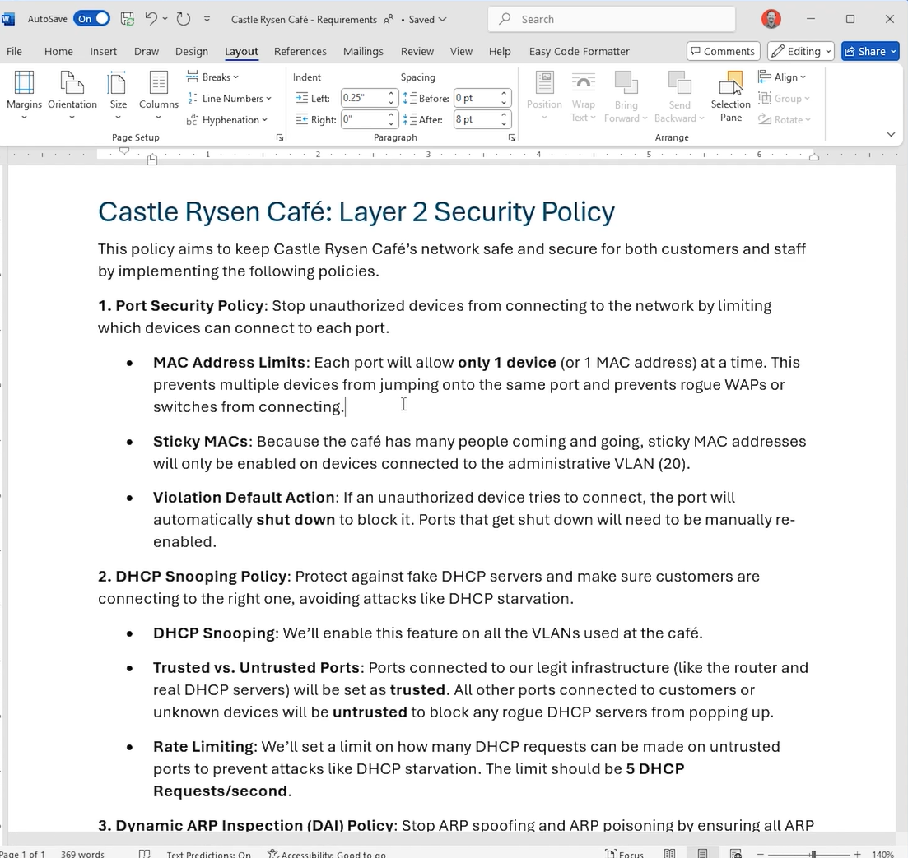
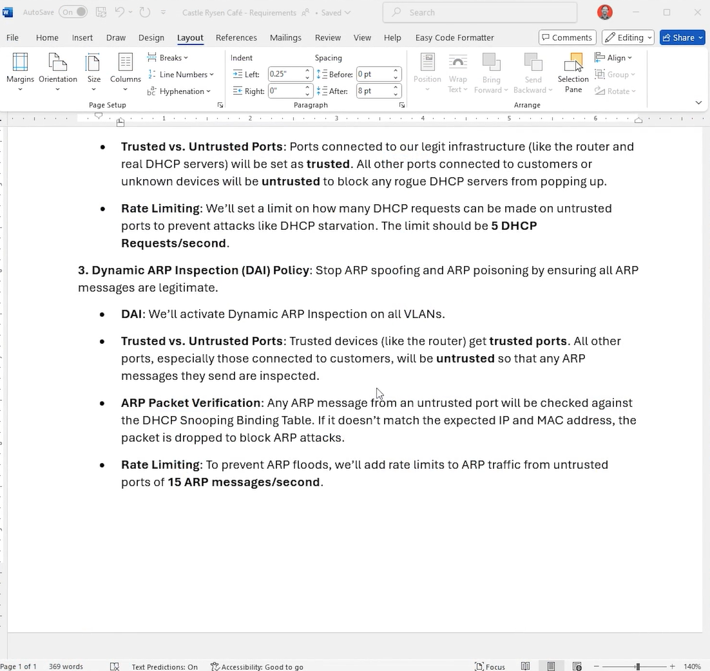

# Week 14 — August 5, 2026

# Lab Notes: Castle Rysen Layer 2 Security Deployment — S20-L04

This lab takes the Layer 2 security policy and applies it to the Castle Rysen switches using **Port Security, DHCP Snooping, and Dynamic ARP Inspection (DAI)**.

The important part is not just the commands. The lab demonstrates how the three controls fit together and how to verify whether the intended security policy is actually being enforced. 

---



# 1. Lab Objective

Implement a Layer 2 security baseline across the Castle Rysen cafe switches:

```text
                    Layer 2 Security
                          |
          +---------------+---------------+
          |               |               |
          ↓               ↓               ↓
   Port Security    DHCP Snooping        DAI
          |               |               |
       MAC limit      DHCP protection   ARP protection
          |               |               |
          +---------------+---------------+
                          |
                    Secure Access Layer
```

The policy specifies:

* **1 MAC address per secured port**
* **Sticky MAC only for administrative devices**
* **Shutdown** as the port-security violation action
* DHCP Snooping on VLANs **1, 10, 20**
* Infrastructure ports trusted for DHCP
* Client-facing ports untrusted
* DHCP rate limit of **5 packets/sec**
* DAI on VLANs **1, 10, 20**
* ARP inspection on untrusted ports
* ARP rate limit of **15 packets/sec**

These requirements align with the Castle Rysen RFP's requirement for Port Security, DHCP Snooping, and DAI. 

---

# 2. Port Security

## Switch 1

Initially, you attempted:

```text
int range fa0/3 , fa0/5-23
switchport port-security
```

but received:

```text
Command rejected: FastEthernet0/3 is a dynamic port.
```

### Why?

Port Security requires the interface to be operating as an **access port**, rather than dynamically negotiating its mode.

You corrected it with:

```text
switchport mode access
switchport port-security
```

This is an important troubleshooting sequence:

```text
Port Security rejected
        ↓
Check switchport mode
        ↓
Port is dynamic
        ↓
Configure access mode
        ↓
Enable Port Security
```

---

# 3. Sticky MAC on Switch 1

You configured Fa0/3 with:

```text
switchport port-security
switchport port-security mac-address sticky
```

Fa0/3 is assigned to:

```text
VLAN 10
ADMIN-DEVICES
```

This matches the policy concept that sticky MAC should be used for relatively fixed administrative devices.

The configuration became:

```text
interface FastEthernet0/3
 switchport access vlan 10
 switchport mode access
 switchport port-security
 switchport port-security mac-address sticky
 spanning-tree portfast
 spanning-tree bpduguard enable
```

---

# 4. Port Security Verification

You used:

```text
do show port-security
```

and received entries such as:

```text
Secure Port MaxSecureAddr CurrentAddr SecurityViolation Security Action
Fa0/3        1            0           0                 Shutdown
Fa0/5        1            0           0                 Shutdown
Fa0/6        1            0           0                 Shutdown
...
Fa0/23       1            0           0                 Shutdown
```

### What the columns mean

| Column                | Meaning                                |
| --------------------- | -------------------------------------- |
| **Secure Port**       | Interface protected by Port Security   |
| **MaxSecureAddr**     | Maximum secure MAC addresses           |
| **CurrentAddr**       | Currently learned secure MAC addresses |
| **SecurityViolation** | Number of violations                   |
| **Security Action**   | Action taken after violation           |

Your important results:

```text
Maximum MACs = 1
Violations = 0
Violation action = Shutdown
```

So the policy is being represented correctly.

### Why is CurrentAddr 0?

At the time you checked, the switch had not learned a secure MAC address on those ports.

Once an appropriate device sends traffic through a sticky-enabled port, the switch can learn the MAC.

---

# 5. Important Difference: Sticky vs Non-Sticky

Your configuration intentionally distinguishes between administrative and general endpoint ports.

### Administrative port

```text
Port Security
+
Maximum MAC = 1
+
Sticky MAC
```

### General endpoint port

```text
Port Security
+
Maximum MAC = 1
+
No sticky MAC
```

This distinction is important for Castle Rysen because customer devices are transient.

You don't want the first random customer device to become permanently associated with a patron port.

---

# 6. Switch 2 Port Security

On `cafe01-sw02`, you configured:

```text
interface range fa0/3 , fa0/5-24
 switchport port-security
 switchport port-security maximum 1
```

Then Fa0/24 was configured with sticky MAC:

```text
interface fa0/24
 switchport port-security
 switchport port-security maximum 1
 switchport port-security mac-address sticky
```

Your VLAN table shows:

```text
VLAN 10  ADMIN-DEVICES    Fa0/24
VLAN 20  PATRON-DEVICES   Fa0/3
```

So Fa0/24 is an administrative device port, making sticky MAC appropriate according to the policy.

---

# 7. DHCP Snooping

## Configuration

You enabled DHCP Snooping globally:

```text
ip dhcp snooping
```

Then enabled it for:

```text
ip dhcp snooping vlan 1,10,20
```

Therefore:

```text
VLAN 1
VLAN 10
VLAN 20
```

are protected.

---

# 8. DHCP Trusted Ports

On the switches, you configured the EtherChannel member interfaces:

```text
interface range fa0/1-2
 ip dhcp snooping trust
```

These are the two physical interfaces forming:

```text
Port-channel1
```

and they are trunk/uplink interfaces.

You also configured Fa0/24 as trusted on Switch 1:

```text
interface fa0/24
 ip dhcp snooping trust
```

You subsequently removed the rate limit from that interface:

```text
no ip dhcp snooping limit rate 5
```

which resulted in:

```text
Fa0/24   yes   unlimited
```

---

# 9. DHCP Untrusted Ports

The remaining client-facing interfaces were configured with:

```text
ip dhcp snooping limit rate 5
```

Your verification showed:

```text
Interface       Trusted    Rate limit
Fa0/3           no         5
Fa0/5           no         5
Fa0/6           no         5
...
Fa0/23          no         5
```

This creates the intended boundary:

```text
             DHCP Infrastructure
                     |
                  TRUSTED
                     |
               +-----------+
               |  Switch   |
               +-----------+
                /    |    \
               /     |     \
          UNTRUSTED UNTRUSTED UNTRUSTED
             PC       PC       Camera
```

---

# 10. Why 5 DHCP Requests/sec?

Your policy specifies:

> **5 DHCP Requests/second**

The purpose is to reduce the ability of an endpoint to generate an excessive number of DHCP requests.

This helps mitigate DHCP starvation behavior.

Conceptually:

```text
Attacker
   |
   | Thousands of DHCP requests
   ↓
Switch
   |
   X
Rate limit
   |
   ↓
Only permitted DHCP request rate
```

The important distinction is:

**DHCP Snooping** protects against rogue DHCP server behavior.

**Rate limiting** helps control excessive DHCP request traffic.

They address related but different threats.

---

# 11. DHCP Snooping Verification

You used:

```text
show ip dhcp snooping
```

The switch reported:

```text
Switch DHCP snooping is enabled

DHCP snooping is configured on following VLANs:
1,10,20
```

And:

```text
Option 82 on untrusted port is not allowed
Verification of hwaddr field is enabled
```

Most importantly, the interface table confirmed your trust boundaries.

### Switch 1

```text
Fa0/1   yes   unlimited
Fa0/2   yes   unlimited

Fa0/3   no    5
Fa0/5   no    5
...
Fa0/23  no    5

Fa0/24  yes   unlimited
```

That is the evidence that the policy is actually active.

---

# 12. Switch 2 DHCP Snooping

Switch 2 was configured similarly:

```text
ip dhcp snooping
ip dhcp snooping vlan 1,10,20
```

Trusted:

```text
Fa0/1
Fa0/2
```

Untrusted:

```text
Fa0/3
Fa0/4
Fa0/5
...
Fa0/24
```

with the standard:

```text
5 pps
```

rate limit.

You then deliberately changed Fa0/4 to:

```text
ip dhcp snooping limit rate 500
```

The verification correctly showed:

```text
Fa0/4   no   500
```

while the other untrusted interfaces remained at 5 pps.

This was useful because it demonstrated that DHCP rate limiting is **interface-specific**.

---

# 13. Dynamic ARP Inspection — DAI

Next, you enabled DAI:

```text
ip arp inspection vlan 1,10,20
```

Therefore DAI is active for:

```text
VLAN 1
VLAN 10
VLAN 20
```

The verification showed:

```text
Vlan     Configuration    Operation
1        Enabled          Active
10       Enabled          Active
20       Enabled          Active
```

So DAI is operational on all three VLANs.

---

# 14. DAI Validation

You entered:

```text
ip arp inspection validate src-mac
```

and attempted IP validation as well.

However, your actual verification output is important:

```text
Source Mac Validation      : Enabled
Destination Mac Validation : Disabled
IP Address Validation      : Disabled
```

So **do not write your lab notes as if IP validation was successfully enabled**.

Your actual Packet Tracer output confirms:

```text
Source MAC validation = ENABLED
Destination MAC validation = DISABLED
IP validation = DISABLED
```

That's an excellent example of why:

> **Configuration commands are not proof that the intended feature is active.**

The `show` output is what you should trust for documenting the resulting state.

---

# 15. DAI Trusted Interfaces

On Switch 1 you configured:

```text
interface range fa0/3 , fa0/1-2 , fa0/24
 ip arp inspection trust
```

The resulting output was:

```text
Fa0/1   Trusted
Fa0/2   Trusted
Fa0/3   Trusted
Fa0/4   Untrusted
Fa0/5   Untrusted
...
Fa0/23  Untrusted
Fa0/24  Trusted
```

On Switch 2:

```text
interface range fa0/1-2 , fa0/24
 ip arp inspection trust
```

resulting in:

```text
Fa0/1   Trusted
Fa0/2   Trusted
Fa0/3   Untrusted
...
Fa0/23  Untrusted
Fa0/24  Trusted
```

---

# 16. ⚠️ Important Policy Observation

There is one thing in your Switch 1 configuration that you should understand carefully.

You made:

```text
Fa0/3 → DAI Trusted
```

But Fa0/3 is:

```text
VLAN 10
ADMIN-DEVICES
```

and appears to be an endpoint port.

Your written policy says:

> Trusted devices such as the router get trusted ports; other ports, especially customer-facing ports, remain untrusted.

Therefore, **if Fa0/3 is an ordinary administrative endpoint**, making it DAI-trusted is broader than necessary.

A more conservative policy would generally be:

```text
Infrastructure/uplink → Trusted
End devices → Untrusted
```

So:

```text
Fa0/1 → Trusted
Fa0/2 → Trusted

Fa0/3 → Untrusted
Fa0/4 → Untrusted
...
Fa0/23 → Untrusted

Fa0/24 → depends on what is actually connected
```

This is a good example of the lesson's main message:

> **Don't blindly configure security features. Define what each interface represents first.**

---

# 17. DAI Rate Limiting

Your DAI verification showed:

```text
Interface        Trust State     Rate(pps)    Burst Interval
Fa0/1            Trusted         15           1
Fa0/2            Trusted         15           1
Fa0/3            Trusted         15           1
Fa0/4            Untrusted       15           1
...
Fa0/24           Trusted         15           1
```

The policy specifies:

```text
15 ARP messages/second
```

for untrusted ports.

So the intended protection is:

```text
Client
  |
  | ARP traffic
  ↓
Untrusted port
  |
  +--> DAI validation
  |
  +--> Rate limiting
  |
  ↓
Switch
```

---

# 18. DAI Statistics

You checked:

```text
show ip arp inspection
```

and saw:

```text
Vlan     Forwarded    Dropped
1        0            0
10       0            0
20       0            0
```

And:

```text
Source MAC Failures = 0
Dest MAC Failures = 0
IP Validation Failures = 0
```

This means there were currently **no observed DAI violations** in the lab.

It does **not** mean DAI has been tested against an attack. It means the counters currently contain no violations.

---

# 19. Complete Security Architecture

You can now visualize the Castle Rysen access layer as:

```text
                         CASTLE RYSEN
                              |
                       +--------------+
                       | Access Layer |
                       +--------------+
                              |
          +-------------------+-------------------+
          |                   |                   |
          ↓                   ↓                   ↓
   Port Security       DHCP Snooping             DAI
          |                   |                   |
    MAC restriction     Rogue DHCP          ARP validation
          |              protection                |
          |                   |                    |
          |             Binding Table              |
          |                   |                    |
          +-------------------+--------------------+
                              |
                       VLAN segmentation
                              |
              +---------------+---------------+
              |               |               |
           VLAN 1          VLAN 10          VLAN 20
           Default       ADMIN-DEVICES   PATRON-DEVICES
```

---

# 20. What Each Technology Protects

| Technology          | Attack / Problem                     | Defense                                     |
| ------------------- | ------------------------------------ | ------------------------------------------- |
| **Port Security**   | Unauthorized device/MAC              | Restricts MAC addresses per port            |
| **DHCP Snooping**   | Rogue DHCP server                    | Blocks unauthorized DHCP server messages    |
| **DHCP Rate Limit** | DHCP starvation / excessive requests | Limits DHCP packets per second              |
| **DAI**             | ARP spoofing/poisoning               | Validates ARP information                   |
| **DAI Rate Limit**  | ARP flooding                         | Limits ARP packets per second               |
| **BPDU Guard**      | Rogue STP/BPDU injection             | Err-disables unexpected BPDUs on edge ports |
| **VLANs**           | Excessive Layer 2 trust              | Separates network populations               |

Notice that you're now combining several security mechanisms you've learned during the course rather than treating them as isolated topics.

---

# 21. The Trust Model

This is probably the most important operational concept from the lab.

### Trusted

Infrastructure that you control and expect to generate legitimate network-control traffic.

```text
Router
DHCP Server
Known infrastructure uplink
```

### Untrusted

Endpoints where you don't want users/devices to impersonate infrastructure.

```text
Customer PC
Employee endpoint
Unknown device
```

Think:

```text
                 TRUST BOUNDARY
                      ↓
Infrastructure ─────────────── Endpoints
    TRUSTED                    UNTRUSTED
       |                           |
       ↓                           ↓
DHCP server replies             DHCP requests
legitimate ARP                 Client ARP
routing/network traffic        endpoint traffic
```

---

# 22. Key Troubleshooting Moments From Your Lab

### Problem 1 — Port Security rejected

```text
Command rejected:
FastEthernet0/3 is a dynamic port.
```

### Fix

```text
switchport mode access
switchport port-security
```

---

### Problem 2 — Incorrect interface command

You entered:

```text
int fa0/5-23
```

and IOS rejected it.

Correct syntax:

```text
interface range fa0/5-23
```

This is a small CLI detail but worth remembering.

---

### Problem 3 — DAI verification didn't match your intended configuration

You configured validation commands, but verification showed:

```text
Source MAC Validation      : Enabled
Destination MAC Validation : Disabled
IP Address Validation     : Disabled
```

### Lesson

Always verify the **resulting state**, not merely the commands you typed.

---

### Problem 4 — Different switch, different interface roles

Switch 1 and Switch 2 don't have exactly the same port assignments.

Therefore:

> **Never copy a security configuration blindly from one switch to another.**

First map:

```text
Interface → Device → VLAN → Role → Trust state
```

Then configure.

---

# 23. Best Production Workflow

This lab demonstrates a workflow you should use in real networks:

```text
                Business Requirement
                       ↓
                Security Policy
                       ↓
             Interface Documentation
                       ↓
             Trusted/Untrusted Map
                       ↓
                 Configuration
                       ↓
                    Verify
                       ↓
                     Test
                       ↓
                 Document
```

For Castle Rysen:

```text
"Implement Layer 2 security"
              ↓
Port Security + DHCP Snooping + DAI
              ↓
Define port roles
              ↓
Define trusted interfaces
              ↓
Define MAC limits
              ↓
Define DHCP rate limits
              ↓
Define ARP rate limits
              ↓
Configure
              ↓
SHOW COMMANDS
              ↓
Validate actual state
```

---

# 24. Final Lab Takeaways

### Port Security

```text
1 MAC/device per access port
        +
Shutdown on violation
        +
Sticky MAC for appropriate fixed administrative devices
```

### DHCP Snooping

```text
VLANs 1,10,20
        +
Infrastructure = Trusted
        +
Clients = Untrusted
        +
5 DHCP pps on normal untrusted ports
```

### DAI

```text
VLANs 1,10,20
        +
Infrastructure = Trusted
        +
Endpoints = Untrusted
        +
15 ARP pps
        +
ARP validation
```

### Overall

```text
                 Layer 2 Defense
                       │
       ┌───────────────┼────────────────┐
       ↓               ↓                ↓
   PORT SECURITY   DHCP SNOOPING       DAI
       ↓               ↓                ↓
   MAC control      DHCP control      ARP control
       │               │                │
       └───────────────┼────────────────┘
                       ↓
              Defense in Depth
```

## The most important lesson from your actual lab

**Don't confuse "I entered the command" with "the security policy is working."**

Your `show port-security`, `show ip dhcp snooping`, and `show ip arp inspection` outputs are what establish the actual operational state.

And your DAI output is a particularly good example: although you attempted IP validation, the switch reported **IP Address Validation: Disabled**. That's exactly the sort of discrepancy a network engineer must catch during verification.
