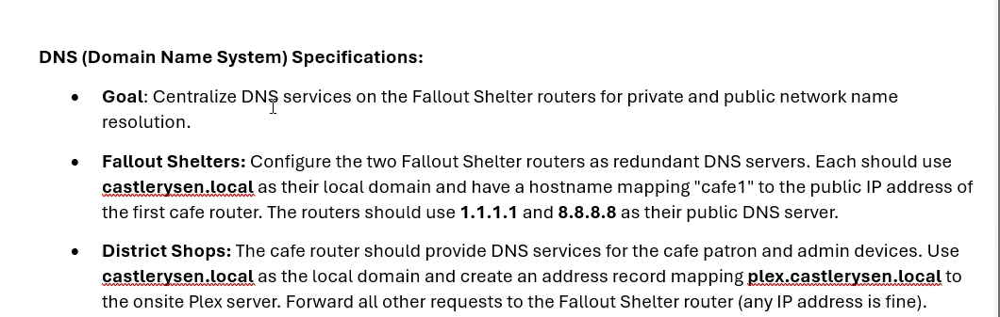
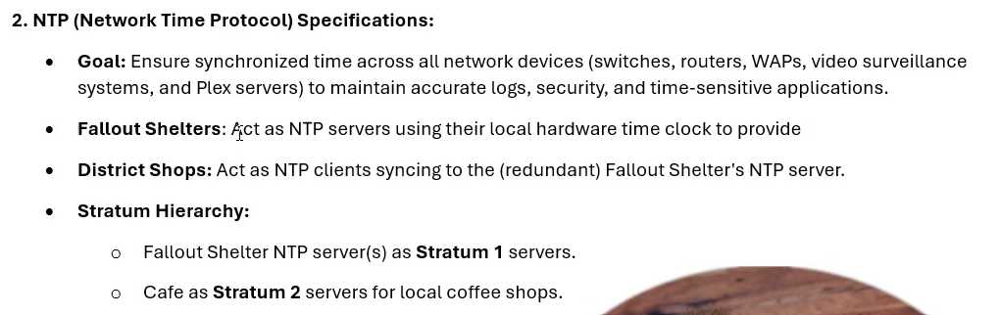
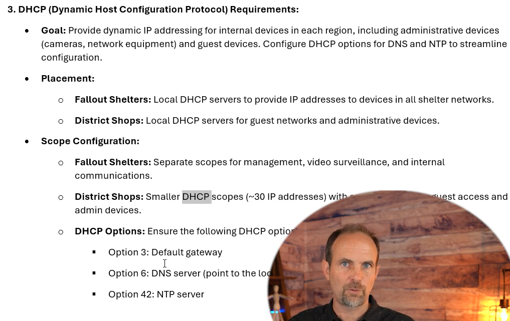

# Deploying IP Services at Castle Rysen — Detailed Explanation

This lesson is the point where the individual services you've learned—**DNS, NTP, DHCP, and remote management**—stop being isolated CCNA topics and become a **deployable network-services architecture** for Castle Rysen.

The important theme is:

> **Take a vague business requirement → design the service architecture → make it repeatable → deploy it → verify that it actually works.**

The Castle Rysen RFP explicitly requires services such as **NAT, DHCP, DNS, NTP, and SSH** at the district shops, so this lesson is about turning those requirements into an actual deployment standard. 




---

# 1. What does "deploying IP services" actually mean?

It is easy to think of IP services as separate configuration exercises:

```text
DHCP → configure pool
DNS  → configure DNS
NTP  → configure NTP
SSH  → configure SSH
```

But in a real network, these services depend on one another.

A better picture is:

```text
                    Castle Rysen
                         |
        +----------------+----------------+
        |                |                |
       DHCP             DNS              NTP
        |                |                |
        |                |                |
        +----------------+----------------+
                         |
                        SSH
                         |
                  Network Management
```

And these services need to be:

* reachable
* consistently configured
* documented
* resilient where appropriate
* secured
* repeatable across sites
* verified after deployment

That's why the lesson emphasizes creating a **documented, repeatable deployment standard** rather than simply entering commands.

---

# 2. Start with the RFP, not the CLI

This is probably the biggest professional lesson in this section.

The RFP doesn't hand you commands like:

```cisco
ip dns server
ntp master
ip dhcp pool ...
```

Instead, it gives you requirements.

For example, Castle Rysen requires IP services including:

* NAT
* DHCP
* DNS
* NTP
* SSH

and requires those services to be deployed as part of the district-shop network. 

Your job as the network engineer is to translate:

```text
Business requirement
        ↓
Technical requirement
        ↓
Network design
        ↓
Configuration standard
        ↓
Deployment
        ↓
Verification
```

That is much closer to real network engineering than simply memorizing Cisco commands.

---

# 3. Why a deployment standard matters

Imagine Castle Rysen opens another district shop.

You could configure it from scratch every time:

```text
New shop
   ↓
Think about DNS
   ↓
Think about NTP
   ↓
Think about DHCP
   ↓
Think about SSH
   ↓
Remember what you did at Shop #1
   ↓
Try to reproduce it
```

That's error-prone.

Instead, you want:

```text
                  Deployment Standard
                         |
            +------------+------------+
            |            |            |
           DNS          NTP          DHCP
            |            |            |
            +------------+------------+
                         |
                        SSH
                         |
                    Verification
```

Then:

```text
Shop #1 ──┐
Shop #2 ──┤
Shop #3 ──┤──> Same standard
Shop #4 ──┤
Shop #5 ──┘
```

This is what **turnkey deployment** means in this context.

The RFP specifically calls for hardware/configuration standards that allow **turnkey rollouts with minimal error**. 

---

# 4. DNS deployment

The first major service discussed is **DNS**.

DNS solves a very simple human problem.

Without DNS:

```text
cafe1 → 172.16.10.2
cafe2 → 172.16.20.2
cafe3 → 172.16.30.2
```

You have to remember IP addresses.

With DNS:

```text
cafe1.castlerysen.local
          ↓
      IP address
```

Humans use names.

The network uses IP addresses.

---

# 5. Castle Rysen's DNS architecture

The lesson describes the Fallout Shelter routers acting as local DNS servers.

Conceptually:

```text
                 Fallout Shelter
                       |
              DNS-capable router
                       |
          +------------+------------+
          |                         |
   Internal DNS                 Public DNS
          |                         |
castle rysen.local          1.1.1.1
                             8.8.8.8
```

This creates two resolution paths.

### Internal names

For example:

```text
cafe1.castlerysen.local
```

can resolve using Castle Rysen's internal DNS information.

### Internet names

For example:

```text
google.com
```

can be resolved using public DNS servers such as:

```text
1.1.1.1
8.8.8.8
```

So the local DNS infrastructure doesn't have to contain the entire Internet DNS database.

---

# 6. DNS forwarding

Think about a client asking:

```text
"What is the IP address of cafe1.castlerysen.local?"
```

The local DNS infrastructure can answer that.

But suppose it asks:

```text
"What is the IP address of example.com?"
```

The local DNS server may not have the answer.

It can forward the request toward an upstream/public DNS server.

Conceptually:

```text
Client
  |
  | DNS query
  v
Castle Rysen DNS
  |
  +---- Internal name?
  |        |
  |       YES → Answer
  |
  +---- External name?
           |
           v
        1.1.1.1
           |
           v
         Answer
```

This is much more scalable than trying to manually maintain every external DNS record.

---

# 7. Host mappings

The lesson gives an example such as:

```text
cafe1.castlerysen.local
```

pointing to the WAN address of the first cafe router.

Imagine:

```text
cafe1.castlerysen.local
          |
          v
      216.x.x.x
```

Now instead of remembering:

```text
216.x.x.x
```

you can use:

```text
cafe1.castlerysen.local
```

This is especially useful for troubleshooting.

For example:

```text
ping cafe1.castlerysen.local
```

is much easier to reason about than:

```text
ping 216.x.x.x
```

when you have dozens of sites.

---

# 8. Why DNS helps troubleshooting

Suppose you have:

```text
Fallout Shelter
       |
       +---- Cafe 1
       +---- Cafe 2
       +---- Cafe 3
       +---- Cafe 4
```

If the engineer sees:

```text
cafe3.castlerysen.local
```

the name immediately communicates what the destination is.

Compare that with:

```text
10.0.18.34
```

The IP address tells you almost nothing by itself unless you consult documentation.

So:

> **Good naming reduces operational ambiguity.**

That is why the lesson says controlling naming improves clarity and makes troubleshooting faster.

---

# 9. Split DNS

The lesson then introduces an important real-world concept:

> **Split DNS**

Split DNS means that the same DNS name can return **different answers depending on where the DNS query originates**.

For example:

```text
bob.castlerysen.com
```

could resolve internally to:

```text
10.10.10.50
```

while an Internet user could receive:

```text
203.0.113.50
```

Same name:

```text
bob.castlerysen.com
```

Different answers.

---

# 10. Why split DNS is useful

Suppose an internal user wants to access:

```text
server.castlerysen.com
```

The server is actually inside the Castle Rysen network.

Without split DNS, the internal user might resolve the public address:

```text
server.castlerysen.com
        ↓
Public IP
        ↓
Internet path
        ↓
Firewall
        ↓
Internal server
```

That's unnecessary.

With split DNS:

```text
Internal user
      |
      | DNS query
      v
Internal DNS
      |
      v
Private IP
      |
      v
Internal server
```

Meanwhile an external user gets:

```text
External user
      |
      | DNS query
      v
Public DNS
      |
      v
Public IP
```

So the **name stays the same**, but the network path becomes appropriate to the user's location.

---

# 11. The important point about split DNS

Don't memorize it as:

> "Split DNS = two DNS servers."

That's not the essence.

The key idea is:

> **DNS responses can differ based on the client's location/network context.**

The purpose is to provide the correct path without forcing internal clients to unnecessarily traverse the public Internet.

---

# 12. Packet Tracer vs real Cisco hardware

This lesson makes another extremely important point.

Packet Tracer is a **learning simulator**, not a complete representation of every feature and behavior of real Cisco IOS.

You may encounter:

```text
Command exists on real Cisco
        |
        v
Packet Tracer doesn't support it
```

or:

```text
Command behaves differently
```

or:

```text
Feature is simplified
```

This does not automatically mean your networking knowledge is wrong.

---

# 13. Why this matters for DNS

The lesson encountered limitations around:

* multiple DNS servers
* configuring a router as a DNS server
* DNS behavior

Real Cisco hardware/IOS can provide capabilities that aren't fully represented in the Packet Tracer environment being used.

For example, the lesson discusses configuring:

```text
multiple name servers
```

and enabling:

```text
IP DNS server
```

on a real router.

The lesson's key advice is:

> **Understand the architecture rather than memorizing simulator behavior.**

That's an excellent networking habit.

---

# 14. Never confuse the simulator with the network

This is worth remembering:

```text
Packet Tracer
     |
     | teaches concepts
     |
     v
Cisco networking knowledge
     |
     v
Real IOS / real hardware
```

Packet Tracer is incredibly useful.

But:

```text
Packet Tracer ≠ complete Cisco IOS
```

So when something doesn't work in Packet Tracer, ask:

1. Is my configuration wrong?
2. Is the feature unsupported?
3. Is the simulator implementing it differently?
4. Would real IOS behave differently?

That troubleshooting mindset becomes increasingly important as you move beyond basic labs.

---

# 15. Loopback interfaces

This is arguably the most important architectural concept in the lesson.

A **loopback interface** is a virtual interface.

For example:

```cisco
interface Loopback0
 ip address 10.255.0.1 255.255.255.255
```

Unlike a physical interface, a loopback isn't physically connected to a cable.

Conceptually:

```text
Physical interface:

Router ---- cable ---- network


Loopback:

Router
  |
  +---- Virtual interface
```

---

# 16. Why use loopbacks?

Suppose you configure NTP using:

```text
Physical interface IP
```

For example:

```text
Router G0/0 = 172.16.0.1
```

You make clients use:

```text
172.16.0.1
```

But then:

```text
G0/0
  |
  X
DOWN
```

The service's address disappears from the network.

Now imagine using a loopback:

```text
Loopback0 = 10.255.0.1
```

and advertising it through OSPF.

Now the network can potentially reach that address through another physical path if the original path fails.

---

# 17. Loopback + OSPF

This is the real architectural idea.

Suppose:

```text
                 Fallout Shelter
                       |
                 Router R1
                  /        \
                 /          \
              Path A       Path B
```

R1 has:

```text
Loopback0
10.255.0.1
```

OSPF advertises:

```text
10.255.0.1/32
```

to the network.

Other routers learn:

```text
10.255.0.1
```

through OSPF.

Now if one physical interface/path fails, routing can potentially select another available path to reach the loopback.

So instead of saying:

> "The NTP server is reachable through GigabitEthernet0/0."

you're effectively saying:

> "The NTP service is reachable at the router's stable logical identity."

That's much better.

---

# 18. Why this is better for DNS and NTP

Imagine your Fallout Shelter router provides:

```text
DNS
NTP
Management
```

Instead of pointing everything at:

```text
Physical interface IP
```

you can design around:

```text
Loopback0
10.255.0.1
```

Then:

```text
DNS clients ───────┐
                   |
NTP clients ───────+----> 10.255.0.1
                   |
Management ────────┘
                         |
                      Loopback0
                         |
                       Router
```

The service endpoint becomes stable.

---

# 19. Why OSPF matters here

The loopback itself doesn't magically provide redundancy.

You need routing.

That's where OSPF comes in.

```text
Loopback
   |
   v
OSPF advertisement
   |
   v
Other routers learn route
   |
   v
Clients can reach service
```

So:

```text
Loopback + OSPF
```

is much more useful than simply:

```text
Loopback
```

---

# 20. The lesson's OSPF troubleshooting moment

The lesson mentions that creating/configuring loopbacks caused an OSPF problem.

That's actually a valuable networking lesson.

When you modify a live routing configuration:

```text
Configuration change
       ↓
OSPF state changes
       ↓
Neighbor relationship affected
       ↓
Routing disrupted
```

This is why production network engineers don't blindly make changes.

You need to understand:

* what you're changing
* what depends on it
* what routing relationships might be affected
* how to verify afterward

A configuration that looks unrelated can have network-wide consequences.

---

# 21. NTP — Network Time Protocol

NTP synchronizes clocks between network devices.

Why does that matter?

Because network devices generate logs.

Imagine:

```text
Router:
14:01:10 → Interface failure

Switch:
14:04:55 → Link failure

Firewall:
13:59:03 → Connection blocked
```

If every device has a different clock, troubleshooting becomes difficult.

You don't know the actual order of events.

With synchronized time:

```text
13:59:03 Firewall event
14:01:10 Router event
14:01:12 Switch event
```

Now you can reconstruct what happened.

---

# 22. NTP architecture in Castle Rysen

The lesson proposes:

```text
             Fallout Shelter
                   |
             NTP Master
                   |
              Loopback IP
                   |
            +------+------+
            |             |
          Cafe 1        Cafe 2
            |             |
         NTP client    NTP client
```

The Fallout Shelter provides the time source.

The district shops synchronize from it.

---

# 23. Stratum

The lesson describes the Fallout Shelter as:

```text
Stratum 1
```

and the cafes naturally become a lower level in the hierarchy.

The important concept is:

> **NTP stratum describes the distance from the authoritative reference clock.**

Lower stratum generally means closer to the authoritative time source.

Conceptually:

```text
Reference clock
      |
  Stratum 0
      |
  NTP server
  Stratum 1
      |
  Fallout Shelter
  Stratum 1
      |
  District Shop
  Stratum 2
```

The exact architecture depends on what source you're actually using, but the lesson's design is treating the Fallout Shelter as the authoritative time source for its downstream cafes.

---

# 24. Why the loopback is useful for NTP

Suppose the Fallout Shelter's NTP service is associated with:

```text
Loopback0
10.255.0.1
```

The cafes can synchronize against:

```text
10.255.0.1
```

instead of a potentially changing physical-interface address.

That gives you:

```text
Stable service address
        +
OSPF reachability
        =
Better service design
```

---

# 25. Packet Tracer and NTP

The lesson points out that Packet Tracer can behave strangely with:

* time zones
* NTP display
* multiple NTP servers

Again:

> **Don't memorize the simulator's weirdness. Understand the NTP architecture.**

The actual goal is:

```text
Reliable time source
        ↓
Network devices synchronize
        ↓
Logs become correlated
        ↓
Troubleshooting improves
```

---

# 26. DHCP — now we're verifying instead of merely configuring

DHCP should already be familiar from your previous lesson.

DHCP automatically provides clients with network configuration such as:

```text
IP address
Subnet mask
Default gateway
DNS server
```

For example:

```text
Client
  |
  | DHCP
  v
Router/DHCP server
  |
  +---- IP address
  +---- subnet mask
  +---- default gateway
  +---- DNS server
```

---

# 27. Castle Rysen DHCP design

The district shop already has separate VLANs.

For example, from your existing configuration:

```text
VLAN 10 → ADMIN
VLAN 20 → PATRON
```

with separate DHCP pools.

Conceptually:

```text
                 Router
                   |
              +----+----+
              |         |
           VLAN 10    VLAN 20
           ADMIN      PATRON
              |         |
           DHCP       DHCP
            pool       pool
```

That is important because different VLANs are different Layer 3 networks.

They need appropriate addressing and DHCP scopes.

---

# 28. Why separate DHCP pools matter

Suppose:

```text
ADMIN:
10.0.18.0/27

PATRON:
10.0.18.32/27
```

Then DHCP must not accidentally give a Patron client an address from the Admin network.

You therefore have separate pools.

For example:

```cisco
ip dhcp pool ADMIN-10
 network 10.0.18.0 255.255.255.224
 default-router 10.0.18.1
 dns-server 1.1.1.1
```

and:

```cisco
ip dhcp pool PATRON-20
 network 10.0.18.32 255.255.255.224
 default-router 10.0.18.33
 dns-server 1.1.1.1
```

The configuration you previously showed for `cafe01-RT01` follows exactly this segmented model.

---

# 29. DHCP Option 42

The lesson introduces **DHCP Option 42**.

Option 42 is used to provide clients with the address of an **NTP server**.

Without Option 42:

```text
Client receives DHCP
       |
       +---- IP
       +---- Mask
       +---- Gateway
       +---- DNS
```

With Option 42:

```text
Client receives DHCP
       |
       +---- IP
       +---- Mask
       +---- Gateway
       +---- DNS
       +---- NTP server
```

So DHCP can help automatically tell clients:

> "This is the time server you should use."

---

# 30. Why this is a good service integration

This is where the lesson becomes more interesting.

Instead of manually configuring every client:

```text
PC 1 → configure NTP manually
PC 2 → configure NTP manually
PC 3 → configure NTP manually
PC 4 → configure NTP manually
```

DHCP can distribute the NTP server information.

Conceptually:

```text
                 DHCP
                  |
        +---------+---------+
        |         |         |
       IP       DNS       NTP
      info      info      info
        |         |         |
        +---------+---------+
                  |
                Client
```

That's automation through network services.

---

# 31. Packet Tracer limitation again

The lesson says the Packet Tracer version being used didn't support the required DHCP Option 42 functionality.

That's important.

It doesn't mean:

> "Option 42 doesn't work."

It means:

> **The simulator used for the lesson doesn't expose/support that functionality in the expected way.**

This distinction is extremely important when working with simulators.

---

# 32. Verification is more important than configuration

This is probably the strongest professional lesson in the entire section.

A beginner often thinks:

```text
I typed the commands.
Therefore:
The service works.
```

A network engineer thinks:

```text
I configured it.
       ↓
I verify it.
       ↓
I test it.
       ↓
I confirm clients can actually use it.
       ↓
Then I call it complete.
```

So:

> **Configuration is not proof of functionality.**

---

# 33. A useful service verification mindset

For each service, think:

### DNS

```text
Can the client resolve the name?
```

### NTP

```text
Is the client/device synchronized?
```

### DHCP

```text
Did the client receive the correct network parameters?
```

### SSH

```text
Can the administrator connect securely?
```

### Routing

```text
Can the client actually reach the service?
```

You need to verify the complete chain.

---

# 34. Putting everything together

Now imagine a new Castle Rysen district shop.

The deployment should look something like:

```text
                     Fallout Shelter
                           |
                    +------+------+
                    |             |
                   DNS           NTP
                    |             |
                    |        Loopback address
                    |             |
                    +------+------+
                           |
                          OSPF
                           |
                           |
                     District Shop
                           |
                     +-----+-----+
                     |           |
                 ADMIN VLAN   PATRON VLAN
                     |           |
                    DHCP        DHCP
                     |           |
                     +-----+-----+
                           |
                         Users
```

And the administrator reaches the equipment through:

```text
Admin VLAN
    |
    | SSH
    v
Router/Switch
```

while security controls restrict management access.

---

# 35. The architecture behind the lesson

You can think of the entire Castle Rysen IP-services design as five layers:

```text
                     SERVICES
                         |
       +-----------------+----------------+
       |                 |                |
      DHCP              DNS              NTP
       |                 |                |
       +-----------------+----------------+
                         |
                     MANAGEMENT
                         |
                        SSH
                         |
                    ROUTING LAYER
                         |
                        OSPF
                         |
                   LOOPBACK ADDRESSES
```

The services aren't isolated.

They depend on:

```text
Addressing
   ↓
Routing
   ↓
Reachability
   ↓
Services
   ↓
Management
   ↓
Security
```

---

# 36. How this relates to your previous lessons

You've already studied these individually:

```text
Subnetting
   ↓
VLANs
   ↓
Inter-VLAN routing
   ↓
OSPF
   ↓
NAT
   ↓
DHCP
   ↓
DNS
   ↓
NTP
   ↓
SSH
```

This lesson starts combining them.

For example:

```text
VLAN
 ↓
Client gets IP using DHCP
 ↓
DHCP gives DNS server
 ↓
DNS resolves destination
 ↓
OSPF provides routing
 ↓
NAT provides Internet access
 ↓
NTP provides time synchronization
 ↓
SSH provides secure management
```

That is much closer to how an actual enterprise network operates.

---

# 37. The most important conceptual distinction

There are three different questions:

### Question 1 — Is it configured?

```text
Did I enter the correct commands?
```

### Question 2 — Is it reachable?

```text
Can the client reach the service?
```

### Question 3 — Is it actually working?

```text
Does the service provide the expected result?
```

For example, DNS:

```text
DNS configured?       → Yes
DNS server reachable? → Yes
Name resolves?        → Yes
```

Only then can you confidently say:

> **DNS is operational.**

---

# 38. Real-world deployment philosophy

The lesson can essentially be reduced to this workflow:

```text
             RFP
              |
              v
       Gather requirements
              |
              v
        Design architecture
              |
              v
      Create deployment standard
              |
              v
          Implement
              |
              v
           Verify
              |
              v
          Document
              |
              v
       Repeat at new sites
```

That's the transition from:

**CCNA student**

to:

**network administrator/network engineer mindset.**

---

# Final mental model

Don't remember this lesson as:

> "Today we configured DNS, NTP, and DHCP."

Remember it as:

> **"We took the Castle Rysen business requirements and turned network services into a standardized, scalable deployment architecture."**

The major ideas are:

* **DNS** gives the network usable names and can distinguish internal vs external resolution through designs such as split DNS.
* **Loopbacks** provide stable logical addresses for infrastructure services.
* **OSPF** advertises those stable addresses so the rest of the network can reach them.
* **NTP** synchronizes device clocks, which is critical for useful logging and troubleshooting.
* **DHCP** automatically distributes client network configuration and can conceptually distribute NTP information through **Option 42**.
* **SSH** provides secure administrative access.
* **Packet Tracer is a simulator**, so unsupported or unusual behavior should be separated from the underlying real-world networking design.
* **Verification is part of deployment**—configuration alone is not proof that a service works.

And the Castle Rysen RFP ties these services together explicitly: its implementation requirements include IPv4/IPv6, routing, VLANs, STP, NAT, DHCP, DNS, NTP, SSH, security controls, monitoring, and automation. 

The important progression is:

```text
Individual commands
       ↓
Individual services
       ↓
Integrated services
       ↓
Repeatable deployment
       ↓
Enterprise network design
```
