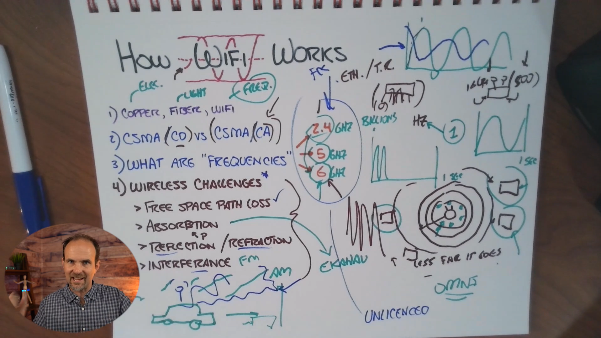

## 📝 Whiteboard Notes — How Wi-Fi Works

Your whiteboard captures the main concepts from **Skill 25 Lesson 01 — Understanding How Wireless Works**. Here is the cleaned-up version while keeping the terminology from the lesson and the diagram.

---

# 1. Three Ways to Carry Bits

The basic idea is that networking is still about transmitting **bits**.

| Medium     | Signal               |
| ---------- | -------------------- |
| **Copper** | Electrical signals   |
| **Fiber**  | Light                |
| **Wi-Fi**  | Radio frequency (RF) |

```text
COPPER  → Electricity
FIBER   → Light
WI-FI   → Radio Frequency
```

So:

> **Wi-Fi is simply another method of transporting bits.**

---

# 2. CSMA/CD vs CSMA/CA

Your whiteboard specifically compares:

**CSMA/CD** vs **CSMA/CA**

### CSMA/CD

**Carrier Sense Multiple Access with Collision Detection**

Historically associated with **shared/half-duplex Ethernet**.

Basic idea:

```text
Listen
  ↓
Transmit
  ↓
Detect collision?
  ↓
Yes → Back off → Try again
```

With modern switched full-duplex Ethernet, collisions are generally eliminated on the link, so CSMA/CD is largely a legacy concept.

---

### CSMA/CA

**Carrier Sense Multiple Access with Collision Avoidance**

Wi-Fi uses collision **avoidance** because wireless devices cannot reliably detect collisions in the same way while transmitting.

Simplified:

```text
Listen to the medium
       ↓
Is it available?
       ↓
    Yes
       ↓
Wait / contention procedure
       ↓
Transmit
```

The important distinction:

> **Ethernet historically detected collisions; Wi-Fi tries to avoid them.**

---

# 3. Wireless Uses Shared Airtime

Your whiteboard's central concept is that multiple wireless devices are sharing the same RF medium.

```text
             WAP
              │
       ┌──────┼──────┐
       │      │      │
      PC    Phone   Tablet
       \      |      /
        \     |     /
        Shared RF
          Airtime
```

If many clients are actively transmitting:

```text
More active clients
        ↓
More contention
        ↓
More shared airtime
        ↓
Less airtime available per client
        ↓
Potentially lower performance
```

This is why **client count alone isn't enough**.

You care about **how many clients are actively communicating**, especially during peak usage.

---

# 4. Frequency — Hz

Your diagram highlights **Hz**.

### Hertz

**1 Hz = 1 cycle per second**

Therefore:

```text
1 MHz = 1 million cycles/second
1 GHz = 1 billion cycles/second
```

Wireless bands discussed in the lesson:

```text
2.4 GHz
5 GHz
6 GHz
```

Conceptually:

```text
Frequency
   ↓
Number of cycles per second
```

---

# 5. 2.4 GHz, 5 GHz and 6 GHz

The whiteboard shows the three major Wi-Fi frequency ranges:

```text
2.4 GHz
   ↓
Longer useful range
Better propagation through obstacles
More crowded

5 GHz
   ↓
Higher performance potential
Shorter useful range

6 GHz
   ↓
Higher performance potential
Shorter useful range
```

### Important correction to the simplified whiteboard idea

Don't memorize:

> **"Higher frequency = automatically more speed."**

That's too simplistic.

Actual wireless throughput depends on factors such as:

* Channel bandwidth
* Modulation
* Coding
* Spatial streams
* Signal quality
* Client capabilities
* Interference
* Airtime availability

The useful CCNA takeaway is the **frequency/range tradeoff**.

---

# 6. Wireless Challenges

Your whiteboard lists the four major physical/RF challenges:

```text
Wireless Challenges
       │
 ┌─────┼───────────────┐
 ↓     ↓               ↓
Free   Absorption   Reflection /
Space                 Refraction
Path Loss
       │
       ↓
   Interference
```

Let's break them down.

---

## 6.1 Free-Space Path Loss

The farther the signal travels, the weaker it becomes.

```text
WAP
 │
 │  Strong
 │
 ├───────────────
 │
 │  Weaker
 │
 ├────────────────────────
 │
 │  Even weaker
```

This is why distance from the AP matters.

### Important enterprise consequence

A weak client may require **more airtime** to successfully communicate.

That can affect other clients sharing the same wireless cell.

---

# 7. Absorption

Your whiteboard lists **absorption**.

Materials can absorb RF energy and weaken the signal.

Examples mentioned in the lesson:

* Drywall
* Brick
* Glass
* Concrete

Conceptually:

```text
WAP )))))))) | WALL | )))))))) Client
             ↓
          RF loss
```

Different materials have different effects on RF propagation.

Therefore, **building construction matters when positioning APs**.

---

# 8. Reflection

RF signals can bounce off surfaces.

```text
              Wall
               │
WAP )))))))) ↘ │
               ↘
                ↘ Client
```

This can create multiple signal paths.

The result can be a complicated RF environment rather than a simple:

```text
AP ─────────── Client
```

straight-line model.

---

# 9. Refraction

The whiteboard also shows **refraction**.

Refraction involves a wave changing direction when moving between different media.

For CCNA-level understanding here:

> **The physical environment can change how RF propagates.**

You don't need to dive deeply into RF physics yet.

---

# 10. Interference

The whiteboard emphasizes **interference**, and the lesson considers this one of the major reasons wireless can be difficult.

Wireless operates in shared spectrum.

So your Wi-Fi can encounter:

```text
Your Wi-Fi
    +
Neighbor Wi-Fi
    +
Other RF sources
    +
Physical environment
    ↓
Real-world RF environment
```

This is why a wireless problem isn't necessarily caused by:

* The AP
* The switch
* The router
* The Internet connection

The **RF environment itself** may be the problem.

---

# 11. The Waveform Drawings

Your whiteboard has several drawings of waves.

The basic idea is that information can be represented using properties of a carrier signal.

You can think of:

```text
Carrier wave
     ↓
Modulated signal
     ↓
Information
```

The exact modulation techniques become much deeper in wireless/RF studies, but for this CCNA lesson, the key point is simply:

> **Wireless transmits information by manipulating radio waves.**

---

# 12. AM and FM References

Your whiteboard also appears to reference:

* **AM**
* **FM**

These are examples of modulation concepts.

### AM — Amplitude Modulation

Information changes the **amplitude** of a carrier.

```text
Amplitude
   ↑
   │     /\       /\
   │    /  \     /  \
───┼───/────\───/────\──
```

### FM — Frequency Modulation

Information changes the **frequency** of the carrier.

```text
Frequency changes
   ↓

/\/\/\/\/\    /\/\    /\/\/\/\/\
```

For your current CCNA lesson, don't get stuck on the mathematical details.

Just understand:

> **Modulation allows information to be represented on a radio-frequency carrier.**

---

# 13. Omni-Directional Coverage

Your whiteboard shows an **OMNI** reference.

An **omnidirectional antenna** generally radiates energy around the antenna in a broad horizontal pattern rather than focusing it into one narrow direction.

Simplified top view:

```text
             )))))
         ))         ((

       ))     AP      ((

         ))         ((
             (((((
```

This is why AP antenna characteristics matter when designing coverage.

The goal isn't simply:

> "Maximum signal everywhere."

Instead:

> **Create the appropriate coverage pattern for the environment.**

---

# 14. Unicast

Your whiteboard also contains **UNICAST**.

Unicast means:

> **One sender → One receiver**

Example:

```text
Laptop ─────────→ WAP
```

or logically:

```text
Device A ─────────→ Device B
```

This is different from:

### Broadcast

```text
One → Everyone
```

### Multicast

```text
One → Interested group
```

For wireless, these traffic patterns can have different implications for airtime and network behavior.

---

# 15. Putting the Whiteboard Together

The whole lesson can be represented like this:

```text
                         WI-FI
                           │
                           ↓
                 Bits over Radio Waves
                           │
             ┌─────────────┴─────────────┐
             ↓                           ↓
         Frequency                  Shared Medium
             │                           │
      ┌──────┼──────┐                    ↓
      │      │      │              CSMA/CA
    2.4G    5G     6G                    │
      │      │      │                    ↓
      └──────┼──────┘              Shared Airtime
             │                           │
             ↓                           ↓
      Range / Capacity             More Clients
             │                           ↓
             │                    More Contention
             │                           ↓
             │                    Less Airtime
             │                           ↓
             └──────────────→ Performance
                           
                    RF Challenges
                         │
       ┌─────────────────┼──────────────────┐
       ↓                 ↓                  ↓
 Free-Space          Absorption       Reflection/
 Path Loss                              Refraction
       │                 │                  │
       └─────────────────┼──────────────────┘
                         ↓
                    Interference
                         ↓
                 Wireless Quality
```

---

# 🎯 What You Should Memorize

### **CSMA/CD**

> Collision **Detection** — historically associated with shared Ethernet.

### **CSMA/CA**

> Collision **Avoidance** — used by Wi-Fi.

### **Hz**

> Cycles per second.

### **2.4 / 5 / 6 GHz**

> Different Wi-Fi frequency ranges with different propagation and performance characteristics.

### **Free-space path loss**

> Signal strength decreases with distance.

### **Absorption**

> Materials weaken/absorb RF energy.

### **Reflection**

> RF signals bounce off surfaces.

### **Refraction**

> RF changes direction when propagating through different media.

### **Interference**

> Other RF activity can negatively affect wireless communication.

### **Shared airtime**

> Wireless clients compete for access to the same medium.

### **Omnidirectional**

> Broad radiation pattern around the antenna.

### **Unicast**

> One sender → one receiver.

---

## 🔥 The most important mental model

Don't think of Wi-Fi as:

```text
Internet
   ↓
Magic
   ↓
Phone
```

Think:

```text
Bits
 ↓
Modulation
 ↓
RF signal
 ↓
Shared wireless medium
 ↓
Propagation through physical environment
 ↓
Interference / attenuation
 ↓
Receiver
 ↓
Bits
```

**That's what "Wi-Fi isn't magic" really means.**
