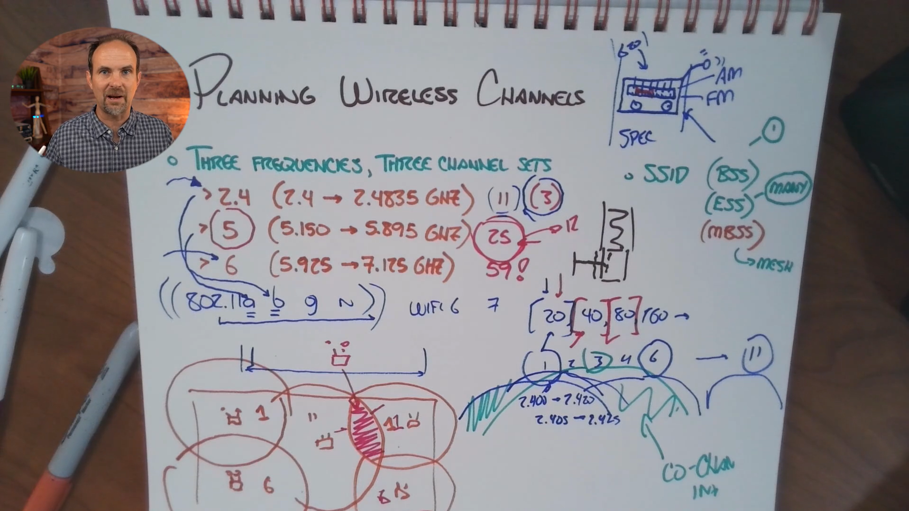

Yes — this board adds several **important details** to the *Planning Wireless Channels* notes. Here’s how to interpret it and what you should retain.

# 📡 Planning Wireless Channels — Board Notes

The instructor summarizes wireless planning around **three frequency bands** and their available channel sets.

## 1. Three Wi-Fi Frequency Bands

The board highlights:

| Band        | Approx. frequency range shown | Main idea                            |
| ----------- | ----------------------------: | ------------------------------------ |
| **2.4 GHz** |                2.4–2.4835 GHz | Longest range, limited channel space |
| **5 GHz**   |               5.150–5.895 GHz | More channel space                   |
| **6 GHz**   |               5.925–7.125 GHz | Much more spectrum for modern Wi-Fi  |

The important conceptual progression is:

```text
2.4 GHz
   ↓
5 GHz
   ↓
6 GHz

More spectrum → more room for wireless deployments
```

The board labels these as **"Three Frequencies, Three Channel Sets."**

---

# 2. 2.4 GHz — The Important Channels

The board specifically circles:

**1, 6, 11**

These are the classic three non-overlapping 20-MHz channel choices used for 2.4 GHz planning.

```text
2.4 GHz

   CH 1        CH 6        CH 11
    ↓           ↓            ↓
  [────]      [────]       [────]
```

### Why not channels 2, 3, 4, etc.?

Because 2.4-GHz channels overlap.

For example:

```text
CH 1
   █████████████

       CH 3
       █████████████
```

The frequency ranges overlap, creating unnecessary RF contention.

Therefore, in a typical 2.4-GHz enterprise design:

```text
AP-1 → CH 1
AP-2 → CH 6
AP-3 → CH 11
AP-4 → CH 1
AP-5 → CH 6
AP-6 → CH 11
```

You **reuse** these channels at appropriate physical distances.

---

# 3. Channel Reuse

The lower diagram on the board is particularly important.

Imagine multiple AP coverage cells:

```text
       AP-1
      CH 1
    (       )

              AP-2
              CH 6
            (       )

       AP-3
       CH 11
     (       )
```

The goal isn't:

> "Give every AP a unique channel."

You usually **don't have enough channels** for that.

Instead:

> **Reuse channels while providing enough physical separation to minimize interference.**

This is a fundamental wireless design concept.

---

# 4. Channel Width

The board also shows:

**20 → 40 → 80 → 160 MHz**

These are channel widths.

```text
20 MHz  → narrow
40 MHz  → wider
80 MHz  → wider
160 MHz → very wide
```

### The tradeoff

```text
Wider channel
      ↓
More spectrum consumed
      ↓
Higher potential throughput
      ↓
Fewer channels available for reuse
```

Whereas:

```text
Narrower channel
      ↓
Less spectrum consumed
      ↓
More channels available
      ↓
Better channel reuse
```

This is why **20 MHz can be preferable in a dense enterprise WLAN**, even though 80/160 MHz sounds faster.

---

# 5. The Board's "Wi-Fi 6 / 7" Reference

The board connects the frequency/channel discussion with newer Wi-Fi generations.

You can think of the progression roughly as:

```text
802.11a/b/g
      ↓
802.11n
      ↓
Wi-Fi 5
      ↓
Wi-Fi 6
      ↓
Wi-Fi 7
```

The important CCNA point isn't memorizing every standard here.

Instead, understand that newer Wi-Fi generations take advantage of improvements in:

* Available spectrum
* Channel widths
* Modulation
* Spatial streams
* Efficiency
* Capacity

So **Wi-Fi generation ≠ frequency band**.

For example, don't think:

> "Wi-Fi 6 means 6 GHz."

That's incorrect.

**Wi-Fi 6** can operate in 2.4 GHz and 5 GHz, while **Wi-Fi 6E** extends Wi-Fi 6 into 6 GHz.

---

# 6. 6 GHz Gives You More Breathing Room

The board's 6-GHz section is showing why the newer band is attractive.

Compared with 2.4 GHz:

```text
2.4 GHz
Limited spectrum
      ↓
Few clean deployment options
      ↓
Difficult in dense environments
```

Whereas:

```text
6 GHz
More spectrum
      ↓
More channel availability
      ↓
More room for dense deployments
```

This is one reason modern enterprise WLAN designs increasingly consider 6 GHz.

---

# 7. Don't Confuse "More APs" With "Better Wi-Fi"

The board's AP drawings reinforce an important design principle.

Suppose you have:

```text
AP-1 ── CH 1
AP-2 ── CH 1
```

and their coverage areas overlap heavily.

Adding AP-2 didn't necessarily solve the problem.

You may have created:

```text
More coverage
     +
More RF competition
     =
Potentially worse performance
```

Good wireless design is therefore:

**Coverage + Capacity + Channel Planning + Interference Management**

—not just signal strength.

---

# 8. SSID → BSS → ESS → Mesh

The right side of the board also connects the channel discussion with wireless architecture:

```text
SSID
 ↓
BSS
 ↓
ESS
 ↓
Mesh
```

### SSID

The **human-readable wireless network name**.

Example:

```text
CastleRysen-Guest
```

### BSS

A single AP/service set.

```text
        AP
         |
      SSID
     / |  \
 Client Client Client
```

### ESS

Multiple APs providing the same WLAN/SSID across a larger area.

```text
       AP-1                 AP-2
      /    \               /    \
   Clients             Clients

       └──── Same SSID ─────┘
```

This allows clients to move around the coverage area and potentially roam between APs.

### Mesh

APs can use wireless links between themselves.

```text
Wired AP
   )))
    )))
     AP
      )))
       )))
        AP
```

Useful when Ethernet cabling isn't practical, but remember:

> **Mesh consumes wireless capacity for the backhaul.**

---

# 🎯 What I Would Add to Your Git Notes

### Wireless Channel Planning — Key Points

* Wi-Fi operates using **RF spectrum divided into channels**.
* Major Wi-Fi bands: **2.4 GHz, 5 GHz, and 6 GHz**.
* In 2.4 GHz, **1, 6, and 11** are the classic non-overlapping 20-MHz channels used for channel planning.
* Neighboring APs should use appropriately separated channels to reduce RF interference.
* **Channel reuse** is necessary because an enterprise WLAN usually has more APs than available clean channels.
* Increasing channel width from **20 → 40 → 80 → 160 MHz** increases potential throughput but consumes more spectrum and reduces channel reuse options.
* More APs do **not** automatically mean better Wi-Fi.
* AP placement must consider **coverage, capacity, interference, and roaming**.
* **SSID** = wireless network name.
* **BSS** = individual wireless service set/AP.
* **ESS** = multiple APs providing an extended WLAN.
* **Mesh** = APs use wireless connectivity for their inter-AP/backhaul connection.
* **Wi-Fi 6 ≠ 6 GHz**. Wi-Fi 6E is the extension that adds 6-GHz operation.

### ⭐ Most important mental model

```text
              WIRELESS DESIGN
                    │
        ┌───────────┼───────────┐
        ↓           ↓           ↓
    FREQUENCY    CHANNEL      COVERAGE
    2.4/5/6      1/6/11       AP placement
                    │           │
                    ↓           ↓
              CHANNEL WIDTH   ROAMING
              20/40/80/160       │
                    │             │
                    └──────┬──────┘
                           ↓
                    RF PERFORMANCE
```

The **big lesson from the board** is: **you aren't just choosing a Wi-Fi channel—you are designing how multiple APs share limited RF spectrum.**
