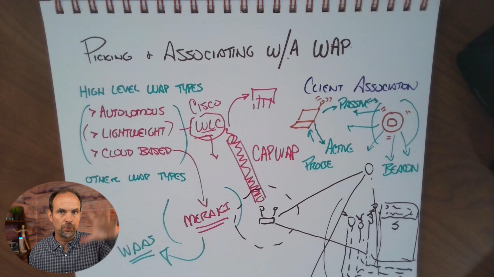

# CCNA — Week 17, August 25

# Skill 25 Lesson 03: Selecting and Associating with the Appropriate WAP

This lesson has **two major parts**:

1. **Selecting the appropriate WAP for the deployment**
2. **Understanding how a wireless client discovers and associates with a WAP**

The important real-world idea is:

> **Choosing a WAP isn't just about transmit power or coverage. You have to consider the environment, antenna characteristics, management architecture, failure behavior, and client capabilities.**

---

# 1. What Is a WAP?

**WAP = Wireless Access Point**

A WAP provides wireless connectivity between wireless clients and the wired network.

Conceptually:

```text
                  Wired Network
                       |
                    Switch
                       |
                      WAP
                  /    |    \
                 /     |     \
              Laptop  Phone   Tablet
```

The WAP acts as the wireless access point into the network.

Examples of wireless clients:

* Laptop
* Smartphone
* Tablet
* Wireless printer
* IoT device
* POS terminal

---

# 2. Selecting a WAP Is a Design Decision

Different environments require different WAP designs.

For example, a coffee shop could have:

* Indoor customer area
* Outdoor patio
* Parking lot
* Pickup area
* Staff area
* High-density seating area

These areas don't necessarily have the same requirements.

### Example

```text
Coffee Shop
│
├── Indoor seating
│      └── Indoor WAP
│
├── Patio
│      └── Outdoor-rated WAP
│
└── Parking / pickup
       └── Outdoor / directional design
```

So don't start with:

> "Which WAP has the strongest signal?"

Start with:

> **"What wireless problem am I trying to solve?"**

---

# 3. Indoor vs Outdoor WAPs

One of the first choices is the physical environment.

### Indoor WAP

Designed for environments such as:

* Offices
* Classrooms
* Coffee shops
* Homes
* Hospitals
* Warehouses

### Outdoor WAP

Designed for environments such as:

* Outdoor seating
* Parking lots
* Campuses
* Stadiums
* Courtyards
* Public spaces

Outdoor deployments have additional environmental considerations.

You may have:

* Weather
* Temperature changes
* Moisture
* Greater physical distances
* Different mounting requirements

Therefore an indoor AP shouldn't simply be mounted outdoors because it happens to have enough transmit power.

---

# 4. Omnidirectional vs Directional Antennas

A major WAP selection decision is the antenna pattern.

## Omnidirectional Antenna

An omnidirectional antenna provides coverage broadly around the AP.

Conceptually:

```text
          ↑
       ↗     ↖
     ←    AP    →
       ↘     ↙
          ↓
```

This is useful when you want general coverage around the AP.

Typical example:

```text
              AP
               |
       ┌───────┼───────┐
       │       │       │
     Client  Client  Client
```

---

# 5. Directional Antenna

A directional antenna focuses RF energy toward a particular direction.

Conceptually:

```text
        AP
         \
          \
           \>>>>>>>>>>>>>
             RF coverage
```

This can be useful when you need to cover a specific area.

Examples:

* Long hallway
* Outdoor parking area
* Building-to-building wireless link
* Long outdoor queue

But there is a **critical limitation**.

---

# 6. Wireless Communication Is Two-Way

This is probably the most important concept in this lesson.

Imagine:

```text
          VERY POWERFUL AP
                 ↓
                 ↓
                 ↓
              Client
```

The AP might transmit strongly enough for the client to hear it.

But communication isn't one-way.

The client must also transmit back.

```text
       AP  ───────────→ Client
          "Can you hear me?"

       AP  ←─────────── Client
          "Yes, I can hear you."
```

If the AP has a powerful directional antenna but the client has a small antenna and limited transmit capability:

```text
AP ───────────────→ Client
       GOOD

Client ──→ AP
    WEAK
```

The connection can become unreliable.

### Critical rule

> **Wireless range is determined by the ability of BOTH sides to communicate—not merely by how far the AP can transmit.**

---

# 7. The "I Can Hear the AP" Problem

This is an excellent troubleshooting scenario.

A client may see:

```text
Wi-Fi network
████████████████  Excellent signal
```

and yet fail to connect reliably.

Why?

Because **receiving the AP's transmission isn't the same as successfully completing two-way communication**.

You need a viable RF link in both directions.

### Mental model

```text
             DOWNLINK
        AP ───────────→ Client
             ↑
          AP power


             UPLINK
        AP ←─────────── Client
             ↑
        Client capability
```

The weaker side can become the limiting factor.

---

# 8. WAP Model #1 — Autonomous WAP

An **autonomous WAP** is individually managed.

Each AP has its own configuration.

```text
Network
  |
  +── AP-1 → Configure separately
  |
  +── AP-2 → Configure separately
  |
  +── AP-3 → Configure separately
```

You manage each AP independently.

### Advantages

* Simple
* Doesn't require a centralized wireless controller
* Suitable for small deployments
* Straightforward architecture

### Disadvantages

As the number of APs increases:

```text
1 AP
 ↓
Easy

5 APs
 ↓
More management

20 APs
 ↓
Lots of individual configuration

100 APs
 ↓
Management nightmare
```

You have to maintain configurations individually.

### Best fit

Small environments where centralized management isn't necessary.

---

# 9. WAP Model #2 — Lightweight WAP

A **lightweight WAP** relies on a centralized **Wireless LAN Controller (WLC)**.

Instead of configuring every AP individually:

```text
             WLC
          /   |   \
         /    |    \
       AP-1  AP-2  AP-3
```

The WLC becomes the central management point.

It can provide centralized control over the AP fleet.

---

# 10. Why Enterprises Like Lightweight APs

Imagine a company with:

```text
HQ
 ├── 30 APs
 ├── 50 APs
 └── 100 APs
```

Managing every AP individually would be inefficient.

With a controller:

```text
                 WLC
                  |
       ┌──────────┼──────────┐
       ↓          ↓          ↓
     AP-1       AP-2       AP-3
       ↓          ↓          ↓
    Clients    Clients    Clients
```

Centralized management becomes much easier.

You can centrally manage things such as:

* WLAN configuration
* SSIDs
* AP configuration
* Security settings
* Radio settings
* Multiple APs

---

# 11. CAPWAP

In Cisco environments, lightweight APs commonly use:

**CAPWAP**

**CAPWAP = Control And Provisioning of Wireless Access Points**

The lesson describes CAPWAP as a protocol that helps APs:

* Find their controller
* Receive configuration
* Communicate with the controller
* Tunnel traffic in supported deployment models

Conceptually:

```text
                WLC
                 |
             CAPWAP
          /     |     \
        AP-1   AP-2   AP-3
```

The AP can essentially:

```text
Boot
 ↓
Find controller
 ↓
Establish CAPWAP relationship
 ↓
Receive configuration
 ↓
Operate as part of WLAN
```

---

# 12. Lightweight AP Dependency

Centralization creates an important tradeoff.

The AP depends on the controller for important functionality.

So consider:

```text
          WLC
           X
      Controller failure
           ↓
     What happens to APs?
```

The exact behavior depends on the platform, software, and deployment architecture, so don't memorize the oversimplified idea that **every lightweight AP instantly becomes completely useless**.

The lesson's practical warning is about **controller dependency**:

> Before deploying a controller-based WLAN, understand what happens when the controller becomes unavailable.

This is an important network-design question.

---

# 13. Cloud-Based WAP

Cloud-managed WAPs use centralized management hosted by the vendor's cloud platform.

Conceptually:

```text
             Cloud Management
                    |
          ┌─────────┼─────────┐
          ↓         ↓         ↓
        AP-1      AP-2      AP-3
```

Instead of managing an on-premises WLC, you manage the WLAN through a cloud dashboard.

---

# 14. Cloud WAP Advantages

Cloud-managed WLANs can provide:

* Centralized management
* Easy deployment
* Remote administration
* Centralized monitoring
* Fleet-wide configuration
* Vendor-hosted management platform

This can be particularly useful for organizations with many geographically distributed locations.

---

# 15. Cloud WAP Tradeoffs

Cloud management introduces dependencies.

You need to consider:

### Internet connectivity

```text
Site
 ↓
Internet
 ↓
Cloud management
```

What happens if Internet connectivity is lost?

### Subscription/licensing

Cloud systems commonly involve licensing/subscription models.

What happens if:

* Subscription expires?
* License isn't renewed?
* Vendor changes the platform?
* Cloud service becomes unavailable?

These are legitimate **architecture and operational questions**.

---

# 16. Comparing the Three WAP Models

| Feature                | Autonomous            | Lightweight           | Cloud-based                            |
| ---------------------- | --------------------- | --------------------- | -------------------------------------- |
| Management             | Individual            | Central WLC           | Cloud platform                         |
| Centralized management | ❌                     | ✅                     | ✅                                      |
| Controller             | No                    | On-prem/WLC           | Vendor cloud                           |
| Scalability            | Lower                 | High                  | High                                   |
| Best fit               | Small deployments     | Enterprise            | Distributed/cloud-managed environments |
| Main concern           | Individual management | Controller dependency | Cloud/subscription dependency          |

### Easy memory

```text
Autonomous
= AP manages itself

Lightweight
= WLC manages APs

Cloud
= Cloud platform manages APs
```

---

# 17. Choosing Between Them

For a tiny coffee shop:

```text
1 location
2 APs
few users
     ↓
Autonomous may be sufficient
```

For a large enterprise:

```text
Many APs
Many users
Centralized policies
     ↓
Controller-based WLAN
```

For geographically distributed locations:

```text
100 coffee shops
     ↓
Centralized cloud management
     ↓
Manage WLAN fleet remotely
```

The correct answer depends on **requirements**, not simply which technology is newer.

---

# 18. Client Wireless Discovery

Now we move from:

> **How do we choose/deploy the AP?**

to:

> **How does the client find the AP?**

There are two major discovery mechanisms covered in this lesson:

1. **Passive discovery**
2. **Active discovery**

---

# 19. Passive Discovery

In passive discovery, the AP sends **beacon frames** periodically.

The beacon essentially announces:

> "I'm here, and this WLAN is available."

Conceptually:

```text
                 AP
                 │
       Beacon ↓  ↓  ↓
          )))))))))))
        )))))))))))))))
      )))))))))))))))))))
            Client
```

The client listens for these beacon frames.

It can then display the available WLAN.

Example:

```text
Wi-Fi Networks

☑ CastleRysen-Staff
☑ CastleRysen-Guest
☑ NeighborWiFi
```

---

# 20. Beacon Frames

A **beacon** is an IEEE 802.11 management frame transmitted by an AP.

It provides information about the WLAN.

At a high level, the client can learn information such as:

* SSID
* Supported capabilities
* Supported rates
* Security-related information
* Channel information

The exact contents depend on the WLAN standard and configuration.

### Key point

> **Passive discovery = client listens for AP beacons.**

---

# 21. Active Discovery

With active discovery, the client actively asks:

> **"What wireless networks are around me?"**

It does this using a **Probe Request**.

```text
Client
   |
   | Probe Request
   ↓
  ~~~~~~~~~~~~~
   Wireless RF
  ~~~~~~~~~~~~~
   ↑      ↑
 AP-1    AP-2
   |      |
Probe     Probe
Response Response
```

Nearby APs can respond with **Probe Response** frames.

---

# 22. Passive vs Active Discovery

|                            | Passive               | Active                    |
| -------------------------- | --------------------- | ------------------------- |
| Client listens             | ✅                     | Sometimes                 |
| AP sends beacon            | ✅                     | APs still beacon normally |
| Client sends probe request | ❌                     | ✅                         |
| Main idea                  | "Listen for networks" | "Ask what's available"    |

### Memory trick

**Passive = Listen**

**Active = Ask**

---

# 23. What Happens After Discovery?

Discovery is only the beginning.

A simplified WLAN connection sequence is:

```text
1. Discover WLAN
       ↓
2. Select WLAN/AP
       ↓
3. Authentication/association
       ↓
4. Security negotiation
       ↓
5. Obtain network configuration
       ↓
6. Send/receive data
```

The lesson simplifies this as:

> **Hear beacons → send probes → choose a network → associate → communicate**

---

# 24. Association

**Association** is the process through which a wireless client establishes its relationship with an AP.

Conceptually:

```text
Client
   |
   | Authentication / Association
   ↓
  AP
   |
   ↓
Wireless connection
```

Don't confuse:

### Authentication

"Are you allowed to join?"

with:

### Association

"Establish the client's relationship with this AP."

Modern Wi-Fi security can involve additional authentication/security exchanges after the initial 802.11 management process.

---

# 25. Selecting the Appropriate AP

Suppose your building has:

```text
AP-1       AP-2       AP-3
 |          |          |
 |          |          |
Users      Users      Users
```

A client may detect multiple APs advertising the same SSID.

For example:

```text
CastleRysen-Staff

AP-1  → strong signal
AP-2  → medium signal
AP-3  → weak signal
```

The client selects an AP based on its wireless decision-making and the information available to it.

### Important

Don't reduce AP selection to:

> **"The client always picks the AP with the strongest signal."**

Real client roaming/selection behavior is more complicated and can depend on client implementation, RF conditions, capabilities, and WLAN features.

---

# 26. The Client Is an Active Participant

This is a major troubleshooting concept.

Wireless isn't:

```text
AP → Client
```

It's:

```text
AP ↔ Client
```

The client:

* Scans
* Discovers networks
* Evaluates APs
* Associates
* Transmits
* Receives
* Decides when to roam

Therefore:

> **The client itself can be the source of a wireless problem.**

---

# 27. Wireless Isn't a Perfect Medium

Ethernet gives us a relatively controlled physical medium.

Wireless uses shared radio spectrum.

Therefore wireless naturally experiences things like:

* RF interference
* Signal attenuation
* Retransmissions
* Frame loss
* Collisions/contention
* Changing RF conditions

So:

> **Some wireless retransmissions and frame loss are normal.**

The objective isn't zero imperfections.

The objective is:

> **Reliable performance appropriate to the business requirement.**

---

# 28. 802.11 Acknowledgements

IEEE **802.11** includes Layer 2 acknowledgement behavior.

A simplified exchange looks like:

```text
Sender
  |
  | DATA
  ↓
Receiver
  |
  | ACK
  ↓
Sender
```

If the sender doesn't receive the expected acknowledgement, it can retransmit.

```text
DATA
 ↓
No ACK
 ↓
Retransmit
 ↓
ACK
```

This helps wireless operate despite the inherent unreliability of the RF medium.

---

# 29. Wireless Retransmissions Are Not Automatically a Disaster

Suppose monitoring shows:

```text
Retransmissions: Present
```

Don't immediately conclude:

> "The AP is broken."

Some retransmissions are expected.

The real question is:

> **Are retransmissions excessive enough to affect application performance?**

For example:

```text
Low / normal retransmission
        ↓
Likely acceptable

High retransmission
        ↓
Investigate
        ↓
Interference?
Weak signal?
Client issue?
Channel utilization?
Physical obstruction?
```

---

# 30. Real-World WAP Selection Example

Imagine Castle Rysen Coffee has:

### Indoor seating

```text
High client density
        ↓
Indoor AP
        ↓
Omnidirectional coverage
        ↓
Careful channel planning
```

### Outdoor patio

```text
Outdoor environment
        ↓
Outdoor-rated AP
        ↓
Weather/environment considerations
```

### Parking pickup area

```text
Long, narrow coverage area
        ↓
Potential directional antenna
        ↓
BUT...
        ↓
Client uplink must also work
```

This is exactly the kind of design thinking the lesson is trying to teach.

---

# 31. Enterprise WAP Decision Process

A practical process looks like:

```text
                 Requirements
                      ↓
             Number of clients
                      ↓
             Coverage area
                      ↓
             Client density
                      ↓
             Indoor / outdoor
                      ↓
              RF environment
                      ↓
             Antenna pattern
                 /         \
        Omnidirectional   Directional
                 \         /
                  ↓
             AP architecture
          /         |         \
   Autonomous   Lightweight   Cloud
                  ↓
             Management
                  ↓
             Redundancy
                  ↓
             Cost/licensing
                  ↓
             Deploy + test
```

---

# 32. Castle Rysen Connection

The Castle Rysen RFP specifically requires:

* Wireless infrastructure
* Access points
* Controllers
* WLAN components
* Wireless security
* VPNs for secure remote access
* Support for the different Castle Rysen locations 

This makes centralized wireless management particularly relevant when thinking about the **central office → fallout shelter → district shop** hierarchy.

For example:

```text
                  Castle Rysen
                       |
                Central Management
                       |
          ┌────────────┼────────────┐
          ↓            ↓            ↓
      Fallout       Fallout       Fallout
      Shelter       Shelter       ...
          |
     District Shops
          |
       Multiple APs
```

The larger the deployment becomes, the more valuable centralized management becomes.

---

# 33. Troubleshooting Checklist

If a client says:

> **"I can see the Wi-Fi but I can't connect."**

Don't immediately replace the AP.

Check:

### Step 1 — Discovery

Can the client see the SSID?

```text
YES → Discovery is occurring
NO  → Investigate RF/AP/SSID/client scanning
```

### Step 2 — Signal

Is the signal sufficient?

### Step 3 — Two-way communication

Can the client transmit back successfully?

### Step 4 — Association

Is the client successfully associating?

### Step 5 — Authentication/security

Is the client passing the WLAN security process?

### Step 6 — IP connectivity

After joining Wi-Fi:

```text
Client
 ↓
DHCP
 ↓
IP address
 ↓
Default gateway
 ↓
Network
```

A successful wireless association doesn't necessarily mean successful IP connectivity.

---

# 34. Important Distinctions

### WAP vs WLC

```text
WAP
= provides wireless access

WLC
= centrally manages controller-based APs
```

### SSID vs BSS

```text
SSID
= WLAN name

BSS
= wireless service set associated with an AP
```

### Discovery vs Association

```text
Discovery
= find WLAN/AP

Association
= establish relationship with AP
```

### Signal vs Connectivity

```text
Strong signal
≠
Guaranteed connectivity
```

### AP transmit power vs wireless range

```text
Higher AP power
≠
Automatically greater usable range
```

Because the client must communicate back.

---

# 🧠 Final Mental Model

Remember this lesson as:

```text
             SELECT THE RIGHT WAP
                     │
       ┌─────────────┼──────────────┐
       ↓             ↓              ↓
   ENVIRONMENT     ANTENNA       MANAGEMENT
       │             │              │
 Indoor/Outdoor   Omni/Directional  │
       │             │        ┌─────┼─────┐
       │             │        ↓     ↓     ↓
       │             │    Auto.  Light. Cloud
       │             │
       └─────────────┼──────────────┘
                     ↓
                DEPLOY WAP
                     ↓
              CLIENT DISCOVERY
                 /       \
                ↓         ↓
           Passive      Active
           Beacons      Probes
                \         /
                 ↓       ↓
                  SELECT
                     ↓
                 ASSOCIATE
                     ↓
               AUTHENTICATE
                     ↓
                COMMUNICATE
```

## ⭐ The 10 things I would memorize

1. **WAP = Wireless Access Point.**
2. **Autonomous WAPs** are individually managed.
3. **Lightweight WAPs** are centrally managed through a **WLC**.
4. **CAPWAP** is used between Cisco lightweight APs and controllers for control/provisioning and, depending on the architecture, data tunneling.
5. **Cloud-managed WAPs** use a vendor-hosted management platform.
6. **Omnidirectional antennas** provide broad coverage.
7. **Directional antennas** focus coverage toward a particular direction.
8. **Wireless is bidirectional** — strong AP transmission doesn't guarantee a usable client uplink.
9. **Passive discovery = beacons; active discovery = probe requests/responses.**
10. **802.11 uses Layer 2 acknowledgements/retransmissions because wireless is inherently less reliable than wired Ethernet.**

### One sentence to remember

> **A good wireless deployment chooses the right AP, antenna, and management architecture for the environment, then ensures clients can discover, associate, authenticate, and communicate reliably—not merely hear a strong Wi-Fi signal.**
