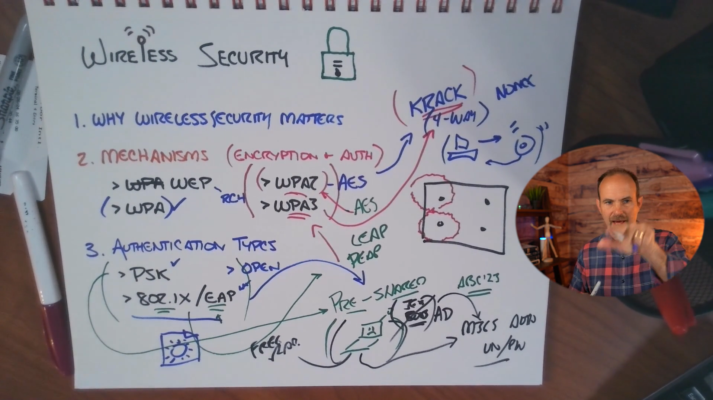

# CCNA — Week 17, August 25

# Skill 25 Lesson 04: Understanding Wireless Security

This lesson completes the wireless fundamentals section by answering a critical question:

> **Once a client can discover and associate with a WAP, how do we prevent unauthorized people from using the WLAN and protect the traffic traveling through the air?**

Wireless is fundamentally different from wired networking because the communication medium is **radio waves**. A wired user generally needs some form of physical access to the network infrastructure; a wireless signal can extend outside the building.

---

# 1. Why Wireless Security Is Important

With Ethernet:

```text
Client
  |
Ethernet cable
  |
Switch
```

Someone generally needs physical access to:

* A cable
* Wall jack
* Switch
* Network equipment
* Building

With wireless:

```text
              Building
        ┌─────────────────┐
        │                 │
        │       AP        │
        │      )))))      │
        │    )))))))))    │
        └─────────────────┘
             )))))))))
          )))))))))))))))
               🚗
            Attacker
```

The RF signal can extend beyond the physical building.

Someone sitting outside could potentially attempt to connect to the WLAN.

### Therefore:

> **Wireless security must assume that unauthorized devices can potentially receive the RF signal.**

This is why simply hiding the AP physically isn't a security mechanism.

---

# 2. Wireless Security Is One Layer of Security

Wireless security is **not the entire network security architecture**.

Think of security as multiple layers:

```text
                 SECURITY
                    │
       ┌────────────┼────────────┐
       ↓            ↓            ↓
   Wireless     Network       Identity
   Security     Security      Security
       │            │            │
 Encryption     Firewall       Accounts
 Authentication ACLs            MFA
       │        Segmentation     │
       └────────────┬────────────┘
                    ↓
              Overall Security
```

Wireless security specifically protects the **wireless portion of the communication**.

Other security controls are still necessary.

Examples:

* Authentication
* Authorization
* MFA
* VLAN segmentation
* Firewalls
* ACLs
* Network policies
* Endpoint security

---

# 3. Two Core Wireless Security Concepts

The lesson emphasizes two fundamental concepts:

## 1. Encryption

Protects the confidentiality of traffic.

```text
Normal data:
"Password123"

        ↓ Encryption

Encrypted data:
"8x$Qp...91K!"
```

If someone intercepts the wireless traffic, encryption makes it difficult/impossible for them to simply read the contents.

---

## 2. Authentication

Determines whether the user/device should be allowed to access the WLAN.

```text
Client
  ↓
"Who are you?"
  ↓
Authentication
  ↓
Valid?
 /    \
YES    NO
 ↓      ↓
Access  Deny
```

### The difference

**Authentication = Who are you / can you prove your identity?**

**Encryption = Can someone who intercepts the traffic understand it?**

---

# 4. You Need Both

Consider these two situations.

### Authentication without adequate encryption

```text
User authenticated
       ↓
Allowed onto WLAN
       ↓
Traffic intercepted
       ↓
Potential data exposure
```

### Encryption without proper authentication

```text
Traffic encrypted
       ↓
Unauthorized person may still gain access
       ↓
Protected traffic/network resources may be exposed
```

Therefore:

> **Authentication controls access; encryption protects the communication.**

---

# 5. Open Wireless Networks

An **open WLAN** doesn't require a wireless password to initially join.

Example:

```text
Wi-Fi:

CastleRysen-Guest
CastleRysen-Staff 🔒
```

An open network might allow:

```text
Client
  ↓
Connect
  ↓
No Wi-Fi password
```

However, an open WLAN can still use a **captive portal**.

For example:

```text
Connect to Wi-Fi
      ↓
Open network
      ↓
Browser redirects
      ↓
Hotel login / Terms & Conditions
      ↓
Internet access
```

### Important distinction

**Open wireless ≠ necessarily unrestricted Internet access.**

There may be additional controls after association.

But the wireless link itself may not provide encryption in the same way a secured WLAN does.

---

# 6. Evolution of Wireless Security

The lesson gives the historical progression:

```text
WEP
 ↓
WPA
 ↓
WPA2
 ↓
WPA3
```

Each generation was introduced to improve wireless security.

---

# 7. WEP

### WEP = Wired Equivalent Privacy

WEP was one of the earliest widely deployed Wi-Fi security mechanisms.

The name itself suggested that wireless security should provide protection comparable to wired networking.

Unfortunately:

> **WEP proved to be fundamentally weak and is considered obsolete.**

It became practical to break WEP security using attacks that exploited weaknesses in its cryptographic design.

### Modern rule

```text
WEP
❌ Do not deploy
```

For CCNA purposes:

> **WEP = old, weak, obsolete.**

---

# 8. WPA

### WPA = Wi-Fi Protected Access

WPA was introduced as an improvement over WEP.

Think of WPA as a **transition/stopgap improvement**:

```text
WEP
 ↓
Security weaknesses discovered
 ↓
WPA
 ↓
Improved security
```

WPA allowed the industry to improve WLAN security without immediately replacing every existing wireless device.

However, WPA was not the long-term endpoint.

---

# 9. WPA2

### WPA2 = Wi-Fi Protected Access 2

WPA2 represented a major improvement in wireless security.

The lesson specifically highlights **AES**.

### AES

**AES = Advanced Encryption Standard**

WPA2 commonly uses AES-based encryption through **CCMP** in its WPA2-Personal/Enterprise implementations.

Conceptually:

```text
WPA2
  ↓
AES-based protection
  ↓
Strong wireless security
```

WPA2 became extremely widespread and remains important to understand because many existing networks still use it.

---

# 10. WPA3

### WPA3 = Wi-Fi Protected Access 3

WPA3 is the newer generation of Wi-Fi security.

The lesson emphasizes that WPA3 addresses weaknesses associated with WPA2, including aspects of the handshake/security process.

The important progression is:

```text
WEP
Weak
 ↓
WPA
Improved
 ↓
WPA2
Strong and widely deployed
 ↓
WPA3
Newer security improvements
```

### Don't make this mistake

Don't think:

> "WPA3 exists, therefore WPA2 is useless."

That's not correct.

WPA2 is still widely deployed, and the appropriate security choice depends on:

* Hardware support
* Client compatibility
* Network requirements
* Enterprise authentication requirements
* Security requirements

---

# 11. WPA2 vs WPA3 — High-Level View

| Feature                      | WPA2                            | WPA3               |
| ---------------------------- | ------------------------------- | ------------------ |
| Generation                   | Older                           | Newer              |
| Security                     | Strong when properly configured | Improved           |
| Deployment                   | Extremely widespread            | Increasing         |
| AES-based protection         | Yes                             | Yes                |
| Modern security improvements | —                               | Yes                |
| Legacy compatibility         | Better                          | Depends on clients |

For your CCNA notes, the key isn't memorizing every cryptographic detail.

Remember:

> **WEP → obsolete → WPA → transition → WPA2 → strong/widely deployed → WPA3 → newer/improved security.**

---

# 12. Authentication Methods

Once you've chosen your wireless security framework, you still have to answer:

> **How does the client prove that it is allowed to connect?**

Two important approaches from this lesson are:

1. **Pre-Shared Key (PSK)**
2. **802.1X / EAP**

---

# 13. Pre-Shared Key (PSK)

A **Pre-Shared Key** is essentially the familiar Wi-Fi password model.

Example:

```text
SSID:
CastleRysen-Staff

Password:
MyStrongWiFiPassword
```

Users/devices enter the shared secret.

Conceptually:

```text
               Shared Secret
                    │
        ┌───────────┼───────────┐
        ↓           ↓           ↓
      User 1      User 2      User 3
        │           │           │
        └───────────┼───────────┘
                    ↓
                  WLAN
```

Everyone uses the same shared credential.

---

# 14. Advantages of PSK

PSK is:

* Simple
* Easy to deploy
* Easy to understand
* Appropriate for many home networks
* Appropriate for small environments

For example:

```text
Home
 ↓
5 trusted devices
 ↓
Strong PSK
 ↓
Simple management
```

This is perfectly reasonable.

---

# 15. The Problem With Shared PSKs

Imagine a company has:

```text
200 employees
+
100 devices
```

Everyone uses:

```text
WiFi password:
CastleRysen@123
```

Now an employee leaves.

What do you do?

You can't simply disable that individual's access because everyone shares the same credential.

You would need to change the WLAN password:

```text
Old password
     ↓
Change password
     ↓
200 employees
+
100 devices
     ↓
Update credentials everywhere
```

That becomes operationally painful.

---

# 16. The Bigger Problem: Accountability

With a shared PSK:

```text
Password
   ↓
Multiple users
   ↓
Same shared secret
```

It becomes harder to associate WLAN access with a specific identity.

This is one reason enterprise environments commonly move toward **individual authentication**.

---

# 17. 802.1X

**802.1X** provides **port-based network access control** and is widely used to control access to enterprise wired and wireless networks.

For wireless networks, 802.1X commonly works with:

* **EAP**
* A backend authentication server, often **RADIUS**

Conceptually:

```text
                 Authentication Server
                       (RADIUS)
                           |
                           |
Client ─── AP/WLC ─────────┘
   |
   | Identity/authentication
   ↓
802.1X / EAP
```

Instead of everyone sharing one wireless password, users/devices can authenticate individually.

---

# 18. EAP

### EAP = Extensible Authentication Protocol

A very important distinction:

> **EAP is a framework, not a single authentication method.**

There are multiple EAP methods.

Different EAP methods can use different mechanisms, such as:

* Username/password
* Certificates
* Other authentication mechanisms

Therefore:

```text
EAP
 │
 ├── EAP method A
 ├── EAP method B
 ├── EAP method C
 └── ...
```

You don't need to memorize every EAP method for this lesson.

Understand the architecture.

---

# 19. 802.1X Enterprise Authentication

A simplified enterprise WLAN flow:

```text
             Client
                |
                | 802.1X / EAP
                ↓
               WAP
                |
                ↓
             RADIUS
                |
                ↓
         Identity System
```

The backend system determines whether the client/user is authorized.

This can integrate with organizational identity infrastructure.

The lesson gives examples such as:

* Active Directory
* Microsoft 365
* RADIUS

---

# 20. Why 802.1X Is Better for Large Organizations

Imagine Castle Rysen Coffee grows from:

```text
1 shop
 ↓
10 shops
 ↓
100 shops
```

and employees constantly join and leave.

With PSK:

```text
Employee leaves
 ↓
Change shared password
 ↓
Update hundreds of devices
 ↓
Operational headache
```

With individual authentication:

```text
Employee leaves
 ↓
Disable their identity
 ↓
Their WLAN access stops
 ↓
Other users remain unaffected
```

This is a huge operational advantage.

---

# 21. PSK vs 802.1X/EAP

| Characteristic          | PSK                     | 802.1X/EAP                  |
| ----------------------- | ----------------------- | --------------------------- |
| Credential model        | Shared secret           | Individual authentication   |
| Configuration           | Simple                  | More complex                |
| Small/home network      | Excellent fit           | Usually unnecessary         |
| Enterprise              | Limited scalability     | Excellent fit               |
| User-level identity     | Limited                 | Stronger                    |
| Employee departure      | Change shared key       | Disable individual identity |
| Backend authentication  | Not inherently required | Typically required          |
| Operational scalability | Lower                   | Higher                      |

### Easy memory

```text
PSK
= Everyone shares a key

802.1X/EAP
= Individuals authenticate
```

---

# 22. NetworkChuck Coffee Example

Consider two scenarios.

## Small coffee shop

```text
1 location
5 staff devices
10 trusted devices
```

A strong WPA2/WPA3 PSK may be reasonable.

```text
Staff WLAN
     ↓
Strong PSK
```

Simple and manageable.

---

## Large Castle Rysen deployment

Now imagine:

```text
30 Fallout Shelters
×
50 District Shops
×
many employees/devices
```

A single shared password becomes problematic.

Instead:

```text
Employee
   ↓
Individual identity
   ↓
802.1X
   ↓
EAP
   ↓
RADIUS / identity infrastructure
   ↓
WLAN access
```

Now you can disable one person's access without changing everyone else's credentials.

---

# 23. Guest WLAN Security

A business should generally separate guest access from internal resources.

For example:

```text
                    WLAN
                     |
              ┌──────┴──────┐
              ↓             ↓
           Staff          Guest
              |             |
              ↓             ↓
        Internal LAN      Internet
```

The Castle Rysen RFP specifically requires **distinct network segments for internal communication and guest access** at district shops, with guest access restricted to Internet and specified Plex access. 

This is an example of how wireless authentication is only **one part** of the security architecture.

Even if a guest successfully authenticates:

```text
Guest
 ↓
Wireless authentication
 ↓
Guest VLAN
 ↓
Firewall/ACL
 ↓
Internet
```

the guest should not automatically gain access to internal resources.

---

# 24. Wireless Security + Segmentation

This is an important enterprise concept.

Don't think:

> "I encrypted the Wi-Fi, therefore the network is secure."

Instead:

```text
                 Wireless Security
                        │
           ┌────────────┼────────────┐
           ↓            ↓            ↓
      Encryption   Authentication  Segmentation
           │            │            │
          WPA3       802.1X/EAP     VLANs
                                      │
                                      ↓
                                  Firewall/ACL
```

You need multiple layers.

---

# 25. Common Wireless Security Mistakes

### Mistake 1 — Using WEP

```text
WEP
❌
```

It's obsolete and insecure.

---

### Mistake 2 — Using a weak PSK

Example:

```text
password123
```

A shared key should be sufficiently strong and protected.

---

### Mistake 3 — One shared password for everything

```text
Staff
Cameras
Printers
IoT
Guests
      ↓
Same WLAN/password
```

This creates a huge security and segmentation problem.

---

### Mistake 4 — Putting guests on the internal LAN

```text
Guest
 ↓
Internal VLAN
 ↓
❌
```

Guest networks should be appropriately isolated.

---

### Mistake 5 — Thinking encryption solves everything

Encryption protects the wireless communication.

It does not automatically provide:

* Authorization
* Network segmentation
* Least privilege
* Endpoint security
* Application security
* Firewall policy

---

# 26. Authentication vs Authorization

These concepts are easy to mix up.

### Authentication

> **Who are you?**

Example:

```text
Employee → authenticates with 802.1X
```

### Authorization

> **What are you allowed to access?**

Example:

```text
Employee
 ↓
Staff WLAN
 ↓
Internal resources

Guest
 ↓
Guest WLAN
 ↓
Internet only
```

So:

```text
Authentication
       ↓
Identity established
       ↓
Authorization
       ↓
Access determined
```

---

# 27. Wireless Security Troubleshooting

If a client says:

> **"I can see the Wi-Fi, but I can't connect."**

Work through the layers.

```text
Can client see SSID?
       ↓
       YES
       ↓
Can client associate?
       ↓
       YES
       ↓
Authentication successful?
       ↓
       NO
       ↓
Check:
- PSK
- 802.1X
- EAP
- RADIUS
- certificates/credentials
```

If authentication succeeds but the user can't reach an internal resource:

```text
Authentication
      ↓
Successful
      ↓
Check VLAN
      ↓
Check ACL/firewall
      ↓
Check authorization
      ↓
Check routing
```

This prevents you from blaming the wireless signal for every problem.

---

# 28. Security Evolution — Easy Timeline

Memorize this:

```text
WEP
 │
 │ Weak
 ↓
WPA
 │
 │ Improvement / transition
 ↓
WPA2
 │
 │ AES-based security
 ↓
WPA3
 │
 │ Modern improvements
 ↓
Modern WLAN Security
```

---

# 29. The Three Questions You Should Ask

Whenever you're designing a wireless network, ask:

### Question 1 — Who can connect?

**Authentication**

```text
PSK
or
802.1X/EAP
```

### Question 2 — Can outsiders understand intercepted traffic?

**Encryption**

```text
WPA2/WPA3
```

### Question 3 — What can an authenticated device access?

**Segmentation + authorization**

```text
VLANs
ACLs
Firewalls
Policies
```

That gives you a much stronger security model.

---

# 30. Castle Rysen Security Architecture

For your CCNA project, think about the district coffee shop like this:

```text
                     Wireless
                        │
              ┌─────────┴─────────┐
              ↓                   ↓
          Staff WLAN          Guest WLAN
              │                   │
          Authentication      Authentication
              │                   │
         802.1X/EAP             Guest access
              │                   │
              ↓                   ↓
        Admin/Internal        Guest VLAN
              │                   │
              ↓                   ↓
       Internal resources     Internet/Plex
```

The RFP requires guest devices to be separated from administrative devices and limits what guests can access. 

So the security architecture isn't simply:

**"Put WPA3 on the AP."**

It's:

**WLAN security + authentication + segmentation + access control.**

---

# 31. CCNA Exam-Ready Table

| Term               | Meaning                                                                              |
| ------------------ | ------------------------------------------------------------------------------------ |
| **WEP**            | Legacy, insecure wireless security                                                   |
| **WPA**            | Improvement over WEP                                                                 |
| **WPA2**           | Widely deployed stronger WLAN security                                               |
| **AES**            | Advanced Encryption Standard                                                         |
| **WPA3**           | Newer WLAN security generation                                                       |
| **PSK**            | Shared wireless secret/password                                                      |
| **802.1X**         | Port-based access control framework used for enterprise WLAN authentication          |
| **EAP**            | Extensible Authentication Protocol framework                                         |
| **RADIUS**         | Common backend AAA/authentication protocol/server architecture for 802.1X            |
| **Authentication** | Verifies identity/credentials                                                        |
| **Encryption**     | Protects confidentiality of wireless traffic                                         |
| **Authorization**  | Determines permitted access                                                          |
| **Open WLAN**      | Wireless network that doesn't require a Wi-Fi security credential for initial access |
| **Captive portal** | Web-based access/control mechanism often used after joining an open/guest WLAN       |

---

# 🧠 Final Mental Model

```text
                 WIRELESS SECURITY
                        │
          ┌─────────────┴─────────────┐
          ↓                           ↓
    AUTHENTICATION                ENCRYPTION
     "Who are you?"             "Can they read it?"
          │                           │
     ┌────┴────┐                 WPA2/WPA3
     ↓         ↓
    PSK     802.1X/EAP
               │
             RADIUS
               │
        Identity system
                        │
                        ↓
                 AUTHORIZED ACCESS
                        │
                        ↓
              VLAN / ACL / Firewall
                        │
                        ↓
                  What can you use?
```

## ⭐ The most important takeaways

1. **Wireless is inherently exposed** because RF can extend beyond physical walls.
2. **Encryption** protects wireless traffic from being understood if intercepted.
3. **Authentication** determines who/what is allowed onto the WLAN.
4. **WEP is obsolete and insecure.**
5. **WPA improved upon WEP.**
6. **WPA2 introduced strong AES-based protection and became widely deployed.**
7. **WPA3 provides newer security improvements.**
8. **PSK = shared secret**, making it simple but difficult to manage at scale.
9. **802.1X/EAP = individual/enterprise authentication**, typically backed by RADIUS.
10. **EAP is a framework, not a single authentication method.**
11. **Wireless authentication doesn't replace segmentation, ACLs, firewalls, or authorization.**
12. For a **small/home network**, PSK can be appropriate; for a **large enterprise**, 802.1X/EAP is generally much more scalable.

### 🔥 One sentence to remember

> **Wireless security answers three different questions: who can connect (authentication), whether intercepted traffic can be understood (encryption), and what an authenticated device is allowed to access (authorization/segmentation).**
