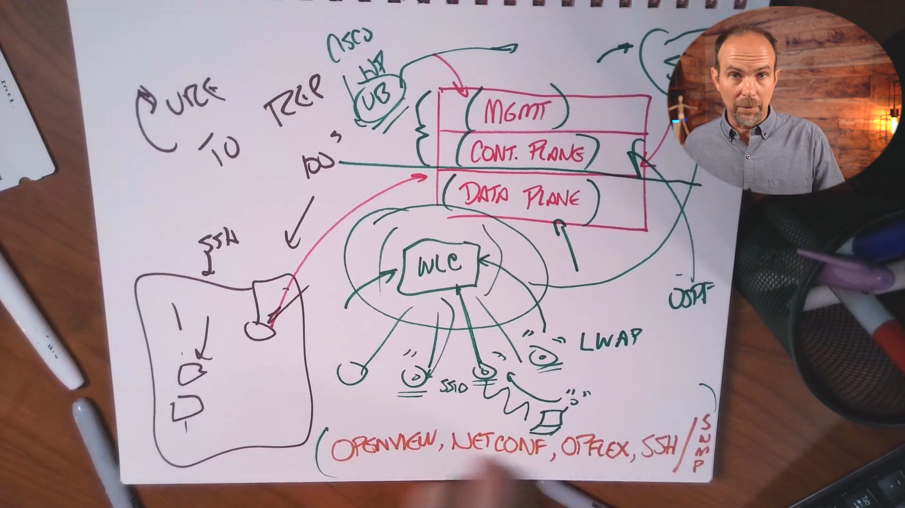

# Skill 26 — Network Automation and SDN

## Lesson 01: Explaining Network Automation and SDN

> **Core idea:** Network automation reduces repetitive manual work, while **Software-Defined Networking (SDN)** goes further by centralizing network intelligence/control.

---

## 1. What Is Network Automation?

**Network automation** is the use of **scripts, software, templates, or centralized management systems** to perform network management tasks automatically instead of configuring devices manually.

### Without automation

Suppose NetworkChuck Coffee has 100 Cisco switches and you need to:

* Change an enable secret
* Configure SSH
* Add a VLAN
* Modify a wireless policy
* Back up configurations

Without automation, you might SSH into every device and repeat the same commands 100 times.

### With automation

You can use a script or automation platform to perform the same operation across many devices.

```text
Manual:
Engineer → Switch 1
         → Switch 2
         → Switch 3
         → ...
         → Switch 100

Automation:
Engineer → Script/Automation Tool → Multiple Devices
```

### Simple definition

> **Network automation = using code or tools to eliminate repetitive network administration tasks.**

---

# 2. Why Network Automation Matters

Automation becomes increasingly valuable as the network grows.

### Small network

```text
1–5 devices
     ↓
Manual configuration may be reasonable
```

### Large network

```text
100+ devices
     ↓
Same configuration repeated many times
     ↓
Manual work becomes slow and error-prone
     ↓
Automation becomes valuable
```

The important scaling problem is **consistency**.

If you manually configure 100 devices, you could accidentally:

* Miss a device
* Type the wrong command
* Use an inconsistent configuration
* Forget to document a change
* Introduce configuration drift

Automation can apply a standardized procedure repeatedly.

---

# 3. Example: NetworkChuck Coffee

Consider a single coffee shop.

It might have:

* 1 router
* Multiple switches
* Wireless APs
* VLANs
* SSH configuration
* Security configuration

Configuring one site manually isn't necessarily difficult.

But Castle Rysen Coffee is designed to scale:

* Central Office
* Fallout Shelters
* Multiple District Shops
* Potential future expansion

The RFP explicitly calls for **automation and programmability** where possible. 

Therefore, instead of manually configuring every new location, standardized configurations could potentially be deployed through automation.

---

# 4. Python and Network Automation

The lesson uses **Python** as a simple example of network automation.

Python is a programming language commonly used to automate tasks.

For example, a Python program could:

```text
Read list of devices
       ↓
Connect to devices
       ↓
Authenticate
       ↓
Send commands
       ↓
Collect results
       ↓
Disconnect
```

Instead of manually logging into every device, the script performs the repetitive work.

### Important

You don't need to think:

> "Automation means I need to automate everything."

A better approach is:

> **Start with one safe, repetitive task.**

Good beginner automation tasks include:

* Backing up configurations
* Checking interface status
* Gathering device information
* Performing controlled configuration changes

Test automation in a lab before using it in production.

---

# 5. The Three Planes of a Network Device

A major concept in this lesson is understanding the **three planes**.

```text
              NETWORK DEVICE
                    │
        ┌───────────┼───────────┐
        │           │           │
   Management    Control      Data
      Plane       Plane       Plane
        │           │           │
   Administration Decisions   Forwarding
```

---

# 6. Management Plane

The **management plane** is concerned with how an administrator interacts with and manages the device.

Examples mentioned in the lesson include:

* SSH
* Web interface
* SNMP
* API calls

### Example

You SSH into a Cisco router:

```text
Administrator
     │
     │ SSH
     ↓
Router
```

You're interacting with the **management plane**.

If you write a Python script that connects to multiple routers and pushes configuration, you're automating management-plane operations.

### Key idea

> **Management plane = administration of the device.**

---

# 7. Control Plane

The **control plane** is responsible for making network decisions.

It determines things such as:

* Where traffic should go
* Network topology
* Routing information
* Best paths

Routing protocols are an important example.

For example:

```text
Router A ─── Router B ─── Router C
    │
    └── Router D
```

The control plane helps determine the appropriate path through the network.

### Key idea

> **Control plane = makes network decisions.**

Think:

**Control = Think**

---

# 8. Data Plane

The **data plane** is responsible for actually forwarding traffic.

Once the network has determined where traffic should go, the data plane moves packets.

```text
Packet
  ↓
Ingress interface
  ↓
Forwarding decision
  ↓
Egress interface
  ↓
Packet continues
```

The lesson emphasizes that this forwarding can happen in hardware using **ASICs**.

### ASIC

**ASIC = Application-Specific Integrated Circuit**

These are specialized chips designed for specific functions, such as high-speed packet forwarding.

### Key idea

> **Data plane = moves packets.**

Think:

**Data = Do / Move**

---

# 9. The Three Planes — Easy Memory Trick

| Plane          | Main Job                     | Think              |
| -------------- | ---------------------------- | ------------------ |
| **Management** | Administrator manages device | **Administration** |
| **Control**    | Makes network decisions      | **Thinking**       |
| **Data**       | Forwards packets             | **Movement**       |

### One-line version

> **Management administers, Control decides, Data forwards.**

This distinction is extremely important for understanding **SDN**.

---

# 10. What Is SDN?

**SDN = Software-Defined Networking**

SDN takes network management beyond simply automating individual devices.

The central idea is:

> **Centralize network intelligence/control instead of requiring every network device to independently make all decisions.**

Traditional networking:

```text
       Router
      /      \
  Think      Forward
```

Each device has its own control-plane intelligence.

SDN:

```text
             SDN Controller
                   │
        ┌──────────┼──────────┐
        ↓          ↓          ↓
      Switch     Router       AP
        │          │          │
        └── Forward traffic ──┘
```

The controller provides centralized intelligence while network devices focus more on forwarding traffic.

---

# 11. Network Automation vs SDN

This distinction is one of the most important parts of the lesson.

### Network automation

Automation generally focuses on automating management tasks.

```text
Engineer
   ↓
Automation Script
   ↓
Device 1
Device 2
Device 3
Device 4
```

The individual devices still have their own control-plane intelligence.

### SDN

SDN goes further.

```text
              Controller
                  │
        Centralized Control
                  │
       ┌──────────┼──────────┐
       ↓          ↓          ↓
    Device      Device     Device
       ↓          ↓          ↓
              Forwarding
```

The control plane is centralized into a controller architecture.

### Comparison

| Network Automation                       | SDN                                      |
| ---------------------------------------- | ---------------------------------------- |
| Automates management                     | Centralizes network control/intelligence |
| Often works with individual devices      | Uses controller-based architecture       |
| Scripts/templates can push configuration | Controller manages network behavior      |
| Devices retain their own control logic   | Control can be centralized               |
| Example: Python configuration script     | Example: controller-based WLAN           |

### Remember

> **Automation automates the work. SDN changes where/how network intelligence is managed.**

---

# 12. Wireless LAN Controller — Practical SDN Example

The lesson uses a **Wireless LAN Controller (WLC)** as a practical example.

Instead of manually configuring every lightweight AP:

```text
Administrator
      │
      ↓
   Controller
   /   |   \
 AP1  AP2  AP3
```

The APs join the controller and receive centralized configuration.

The controller can manage things such as:

* SSIDs
* VLAN mappings
* Wireless policies
* AP configuration

This is a practical example of **controller-based networking**.

---

# 13. Why Centralized Control Is Useful

Imagine 50 APs.

Without centralized management:

```text
Administrator
 ↓
AP1 → Configure
AP2 → Configure
AP3 → Configure
...
AP50 → Configure
```

With a controller:

```text
Administrator
       ↓
  Controller
       ↓
 ┌─────┼─────┐
 AP1  AP2   AP3 ... AP50
```

A policy can be centrally managed rather than individually configured.

This provides a major operational advantage as networks scale.

---

# 14. Is SDN Completely Universal?

**No.**

The lesson makes an important point: we're not yet at a world where every network device from every vendor can simply connect to one universal controller and work perfectly.

Different vendors and platforms can have different:

* APIs
* Management systems
* Protocols
* Architectures
* Capabilities

Therefore, modern network automation and SDN are powerful, but the ecosystem is still somewhat fragmented.

---

# 15. Open Standards and Protocols

The lesson introduces several protocols and technologies associated with network programmability and management:

### OpenFlow

A protocol associated with SDN architectures and communication between controllers and network devices.

### NETCONF

A protocol designed for programmatic network configuration and management.

### OpFlex

A protocol associated with policy-based, controller-oriented networking architectures.

### SSH

Secure remote access to network devices.

```text
Automation system
       ↓
      SSH
       ↓
Cisco device
```

### SNMP

A protocol used primarily for network monitoring and management.

You have already encountered SNMP in **Skill 23**, where you studied SNMPv2c and SNMPv3.

The important point from this lesson is that these technologies form part of the broader ecosystem used to **manage, configure, monitor, and program networks**.

> **You do not need to memorize all of these protocols at this stage.**

---

# 16. Traditional Networking → Automation → SDN

Think of networking evolution as a progression.

### Stage 1 — Manual

```text
Engineer
   ↓
CLI
   ↓
Device
```

You manually configure each device.

### Stage 2 — Automation

```text
Engineer
   ↓
Python / Automation Tool
   ↓
Multiple Devices
```

You still manage individual devices, but software performs repetitive tasks.

### Stage 3 — SDN

```text
Engineer
   ↓
Controller
   ↓
Network Devices
   ↓
Packet Forwarding
```

Network intelligence/control becomes more centralized.

---

# 17. Network Automation Is NOT "The CLI Is Dead"

A very important practical point:

> **Automation does not mean network engineers will never use the CLI again.**

CLI knowledge remains important because you need to understand:

* What you're automating
* What configuration should exist
* What the device is doing
* How to troubleshoot failures
* Whether automation produced the expected result

For your CCNA foundation, think:

```text
CLI knowledge
     +
Networking knowledge
     +
Automation
     =
Better network engineer
```

Automation is an additional capability, not a replacement for understanding networking.

---

# 18. Automation and the Castle Rysen RFP

This lesson directly connects to the final project requirements.

The Castle Rysen RFP calls for:

> **"Utilization of automation and programmability to deploy networks when possible."** 

The RFP's dedicated **Phase 4 — Network Automation and Programmability** also requires learning and implementing automation tools such as:

* Ansible
* Puppet
* Chef

It also calls for:

* Controller-based networking
* Software-defined architectures
* REST-based APIs
* JSON-encoded data 

So this lesson isn't an isolated topic. It is preparing you for the final automation/programmability portion of the Castle Rysen project.

---

# 19. Practical Enterprise Example

Imagine an organization with:

```text
1 Central Office
2 Fallout Shelters
100 District Shops
```

Each shop needs:

* VLANs
* DHCP
* DNS
* SSH
* Security settings
* Routing
* Wireless
* Monitoring

Manual deployment:

```text
100 shops
×
many configuration commands
=
huge operational effort
```

With standardized automation:

```text
Standard Configuration
        ↓
Automation System
        ↓
Shop 001
Shop 002
Shop 003
...
Shop 100
```

This improves **repeatability and consistency**.

---

# 20. Key Concepts to Remember

### Network Automation

> Using software, scripts, templates, or centralized tools to automate repetitive network management tasks.

### Management Plane

> Handles administration and interaction with the device.

Examples:

**SSH, Web UI, SNMP, APIs**

### Control Plane

> Makes network decisions.

Examples:

**Routing protocols and topology decisions**

### Data Plane

> Forwards packets.

Often accelerated by:

**ASICs**

### SDN

> A networking architecture that centralizes network control/intelligence through a controller.

### Controller

> A centralized system that manages or controls network devices/policies.

### WLC

> A practical example of controller-based networking where wireless APs are centrally managed.

---

# 21. Most Important Comparison

```text
                NETWORK DEVICE
                     │
       ┌─────────────┼─────────────┐
       ↓             ↓             ↓
  MANAGEMENT      CONTROL         DATA
       │             │             │
  Admin access   Decisions      Forwarding
       │             │             │
 SSH/API/SNMP    Routing       ASICs
```

Then:

```text
NETWORK AUTOMATION
        ↓
Automates management
        ↓
Less repetitive manual work


SDN
        ↓
Centralizes control
        ↓
Controller-based network


DATA PLANE
        ↓
Still exists
        ↓
Actually forwards packets
```

---

# 22. Exam/Interview Perspective

### Q: What is network automation?

**A:** The use of software, scripts, templates, or management systems to automate repetitive network administration tasks.

### Q: Which plane does SSH belong to?

**A:** **Management plane.**

### Q: Which plane makes routing decisions?

**A:** **Control plane.**

### Q: Which plane forwards packets?

**A:** **Data plane.**

### Q: What hardware can be used for high-speed packet forwarding?

**A:** **ASICs.**

### Q: What does SDN attempt to centralize?

**A:** The **control plane/network intelligence**.

### Q: Is network automation the same as SDN?

**A:** **No.** Automation primarily automates management tasks; SDN goes further by using a controller-based architecture to centralize network control/intelligence.

### Q: Give a practical example of controller-based networking.

**A:** A **Wireless LAN Controller (WLC)** centrally managing lightweight wireless access points.

### Q: Does SDN mean every vendor's devices can be managed by one universal controller?

**A:** **No.** The ecosystem is still not completely universal/interoperable.

---

# 23. Final Mental Model

If you remember only this, remember:

```text
NETWORK AUTOMATION
"Stop making humans repeat the same work."
                │
                ↓
       Scripts / Templates
                │
                ↓
       Automate Management


SDN
"What if network control was centralized?"
                │
                ↓
           Controller
                │
                ↓
       Network Devices


NETWORK DEVICE
 ┌──────────────────────────────┐
 │ Management → Administration  │
 │ Control    → Decisions       │
 │ Data       → Forwarding      │
 └──────────────────────────────┘
```

### ⭐ The three sentences to memorize

1. **Network automation eliminates repetitive manual network-management tasks.**
2. **SDN goes beyond automation by centralizing network control/intelligence through a controller.**
3. **The data plane still performs the actual packet forwarding, often using specialized hardware such as ASICs.**

Your study plan places **Lesson 01 on August 27**, followed by **Lesson 02 (Cisco SDN models/platforms)** and **Lesson 03 (RESTful APIs)** the same day. 
