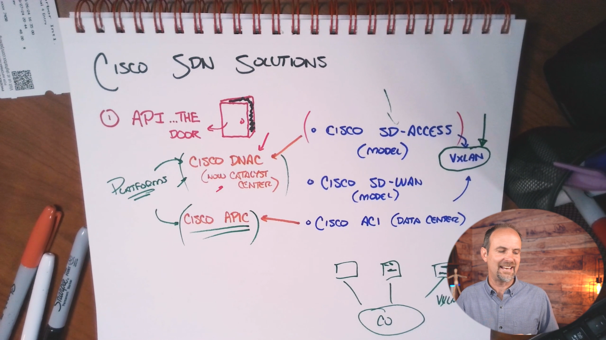

# Skill 26 — Network Automation and SDN

# Lesson 02: Exploring Cisco SDN Models and Platforms

> **Core idea:** Cisco applies the SDN concept differently depending on the environment: **SD-Access for campus networks, SD-WAN for WAN connectivity, and ACI for data centers.** Different environments require different controllers and technologies.

This lesson is largely about **organizing Cisco terminology** so that names like **SD-Access, SD-WAN, ACI, Catalyst Center/DNA Center, APIC, and VXLAN** don't become a collection of unrelated acronyms.

---

# 1. First: What Problem Is Cisco SDN Trying to Solve?

Traditional networking often looks like this:

```text
Administrator
     │
     ├── SSH → Switch 1
     ├── SSH → Switch 2
     ├── SSH → Router 1
     ├── SSH → AP 1
     ├── SSH → AP 2
     └── SSH → ...
```

Every device can have its own:

* Configuration
* Policies
* Control-plane decisions
* Management interface
* Operational state

As the network grows, this becomes difficult to operate consistently.

Cisco's SDN approach moves toward:

```text
                  Central Controller
                         │
          ┌──────────────┼──────────────┐
          ↓              ↓              ↓
       Switches        Routers          APs
```

Instead of thinking primarily:

> **"How do I configure this individual device?"**

you increasingly think:

> **"What policy or behavior do I want across the network?"**

That is the fundamental operational shift.

---

# 2. Models vs Platforms

This distinction is extremely important.

The lesson divides Cisco's SDN ecosystem into two broad categories:

### SDN models

These describe **the type of environment/use case**.

The three major models discussed are:

1. **SD-Access** → Campus
2. **SD-WAN** → Wide Area Network
3. **ACI** → Data Center

### SDN platforms

These are the **controller/software platforms used to implement or manage those environments**.

Examples:

* **Catalyst Center / DNA Center** → SD-Access
* **Cisco SD-WAN controller ecosystem** → SD-WAN
* **APIC** → ACI

Think:

```text
MODEL
"What kind of network problem?"

        ↓

PLATFORM / CONTROLLER
"What Cisco software manages/controls it?"
```

---

# 3. The Three Cisco SDN Models

## The big picture

| Cisco SDN Model | Environment     | Main Purpose                                          |
| --------------- | --------------- | ----------------------------------------------------- |
| **SD-Access**   | Campus / branch | Manage and control campus networking                  |
| **SD-WAN**      | WAN             | Connect and manage geographically distributed sites   |
| **ACI**         | Data center     | Manage application-centric data-center infrastructure |

### Memory trick

> **SD-Access = building**
> **SD-WAN = between buildings**
> **ACI = data center**

Or:

```text
             ENTERPRISE
                 │
       ┌─────────┼─────────┐
       ↓         ↓         ↓
    CAMPUS       WAN    DATA CENTER
       │         │         │
 SD-Access    SD-WAN      ACI
```

This is probably the single most important diagram from this lesson.

---

# 4. SD-Access

## What is SD-Access?

**SD-Access** is Cisco's software-defined approach to the **campus network**.

A campus network could include:

* Building switches
* Wireless access points
* Access-layer networking
* Local routing
* User/device connectivity
* Network policies

For example, imagine a Castle Rysen Coffee shop or corporate office:

```text
                 Campus Network
                       │
          ┌────────────┼────────────┐
          ↓            ↓            ↓
       Switches        APs       Routing
```

SD-Access provides a centralized approach to managing this environment.

---

# 5. Where Would You Use SD-Access?

Think about a large organization.

Suppose you have:

```text
Corporate Campus
│
├── 50 Switches
├── 100 Wireless APs
├── Thousands of users
└── Multiple departments
```

Managing everything device-by-device becomes increasingly difficult.

A software-defined campus approach allows administrators to work from a centralized platform.

### Castle Rysen example

A District Shop might eventually contain:

* Administrative devices
* Patron devices
* Cameras
* Plex server
* Wireless APs
* Switches
* Router/firewall

The RFP specifically requires scalable network infrastructure and centralized management/automation capabilities. 

---

# 6. SD-WAN

## What is SD-WAN?

**SD-WAN = Software-Defined Wide Area Networking**

SD-WAN is designed for the **WAN**, especially networks connecting geographically separated locations.

For example:

```text
Central Office
      │
      │
   ┌──┴─────────────┐
   ↓                ↓
Shelter A         Shelter B
   │                │
   ↓                ↓
Shops             Shops
```

This is a fundamentally different problem from managing devices inside a single building.

---

# 7. Why SD-WAN?

Organizations often have multiple types of WAN connectivity available.

The lesson mentions possibilities such as:

* Internet
* VPN
* MPLS
* Private circuits

A traditional WAN may treat these connections as separate network paths.

SD-WAN can provide centralized control over how these connections are used.

Conceptually:

```text
                    SD-WAN
                       │
          ┌────────────┼────────────┐
          ↓            ↓            ↓
       Internet       MPLS      Private Link
```

The user doesn't necessarily need to care which underlying WAN connection carries their traffic.

The SD-WAN architecture can make the WAN behave as a more unified environment.

---

# 8. SD-WAN Example

Imagine Castle Rysen has:

```text
Central Office
      │
 ┌────┴────┐
 ↓         ↓
Shelter 1  Shelter 2
 │            │
Shops        Shops
```

A location might have:

```text
Internet
   +
MPLS/private circuit
   +
VPN connectivity
```

Rather than manually managing every WAN path individually, SD-WAN provides centralized control and policy.

### Core idea

> **SD-WAN = software-defined management/control of WAN connectivity.**

---

# 9. ACI

## What does ACI stand for?

**ACI = Application Centric Infrastructure**

ACI is Cisco's software-defined model for the **data center**.

Remember:

```text
SD-Access → Campus
SD-WAN    → WAN
ACI       → Data Center
```

---

# 10. Why Is a Data Center Different?

A data center is where applications and services live.

For example:

```text
             DATA CENTER
                  │
      ┌───────────┼───────────┐
      ↓           ↓           ↓
   Servers      Apps       Databases
```

A data center isn't simply about connecting users to switches.

You also need to think about:

* Applications
* Servers
* Workloads
* Policies
* Security
* Connectivity
* Traffic flows

ACI approaches the data center from an **application-centric** perspective.

---

# 11. What Does "Application-Centric" Mean?

Traditional thinking might be:

> "Configure these switches and ports."

Application-centric thinking is closer to:

> "This application needs to communicate with these services under these policies."

The network infrastructure then implements the required connectivity and policy.

This is a major conceptual shift:

```text
Traditional:
Device → Interface → VLAN → Configuration

Application-centric:
Application requirement
        ↓
      Policy
        ↓
 Network infrastructure
```

---

# 12. Cisco SDN Models — One Table to Memorize

| Model         | Full Name                          | Environment | Think             |
| ------------- | ---------------------------------- | ----------- | ----------------- |
| **SD-Access** | Software-Defined Access            | Campus      | Building          |
| **SD-WAN**    | Software-Defined Wide Area Network | WAN         | Connect locations |
| **ACI**       | Application Centric Infrastructure | Data Center | Applications      |

### ⭐ Exam memory

> **Access = Campus**
> **WAN = WAN**
> **ACI = Data Center**

---

# 13. Now: What Is VXLAN?

**VXLAN = Virtual Extensible LAN**

This is an important technology mentioned in the lesson.

The easiest conceptual explanation from the lesson is:

> **VXLAN creates virtual network tunnels across an existing physical network.**

The lesson compares the concept to something like a **VPN inside your own network**.

That is a useful analogy, but remember it is an analogy—not a literal statement that VXLAN is a VPN.

---

# 14. Why Do We Need VXLAN?

Imagine two devices that logically belong to the same network:

```text
Device A
   │
Switch A
   │
   │
Switch B
   │
Switch C
   │
Device B
```

Physically, these devices may be separated by several network devices.

VXLAN allows us to create a **logical overlay network** across an underlying physical network.

Think:

```text
              Logical Network
       Device A ═══════════ Device B
                  VXLAN
                    │
             Physical Network
          ──SW──SW──SW──SW──
```

The physical network provides the transport.

VXLAN provides a logical overlay.

---

# 15. Underlay and Overlay

This is an extremely useful mental model.

## Underlay

The **underlay** is the physical/IP network that provides connectivity.

```text
R1 ─── R2 ─── R3 ─── R4
```

It provides basic reachability.

## Overlay

The **overlay** is the logical network built on top of that physical network.

```text
A ═════════════════════ B
       Logical tunnel
```

So:

```text
OVERLAY
   ↓
Logical network

UNDERLAY
   ↓
Physical/IP transport network
```

### Memory trick

> **Underlay = what physically carries the traffic.**
> **Overlay = logical network built on top of it.**

---

# 16. Why VXLAN Is Powerful

Without overlay technologies, changing logical connectivity can sometimes require physical changes.

For example:

```text
New requirement
     ↓
New VLAN/connectivity
     ↓
Potential physical redesign
     ↓
New links / ports / configuration
```

With overlay technologies, you can create logical networks over an existing infrastructure.

Conceptually:

```text
Existing physical network
──────────────────────────

       ↓ VXLAN

Logical networks
┌───────────────────────┐
│ Network A             │
├───────────────────────┤
│ Network B             │
├───────────────────────┤
│ Network C             │
└───────────────────────┘
```

This is one reason overlay technologies are important in modern scalable network architectures.

---

# 17. VXLAN in Campus and Data Center Environments

The lesson specifically points out that VXLAN can appear in both:

* Campus designs
* Data-center designs

The underlying idea is the same:

> **Create logical connectivity over an existing physical network.**

Instead of thinking only in terms of physical cables and switch ports, network engineers can create logical network structures.

---

# 18. Cisco SDN Platforms

Now we move from **models** to the platforms that implement/manage them.

The key names from this lesson are:

```text
SD-Access
    ↓
DNA Center / Catalyst Center


SD-WAN
    ↓
Cisco SD-WAN controller ecosystem


ACI
    ↓
APIC
```

---

# 19. DNA Center / Catalyst Center

## DNA Center

Cisco's platform historically known as:

**Cisco DNA Center**

Often abbreviated:

**DNAC**

The lesson points out that the platform has been renamed/rebranded as:

**Cisco Catalyst Center**

Therefore, you may encounter both names depending on the material you're reading.

### For your CCNA notes:

```text
DNA Center
     =
Catalyst Center
```

Think of this as the **same general platform family under the newer branding** in the context of this lesson.

---

# 20. What Is Catalyst Center?

Catalyst Center is a centralized management platform for Cisco campus networking.

Instead of managing devices individually:

```text
Administrator
 │
 ├── Switch 1
 ├── Switch 2
 ├── Switch 3
 ├── AP 1
 ├── AP 2
 └── AP 3
```

you can work through a centralized platform:

```text
              Catalyst Center
                    │
        ┌───────────┼───────────┐
        ↓           ↓           ↓
     Switches       APs       Network
```

---

# 21. What Can You See/Manage?

The lesson describes centralized visibility into things such as:

* Device health
* Network topology
* CPU utilization
* Memory utilization
* Provisioning
* Licensing
* Troubleshooting information

Instead of looking at individual devices separately, the administrator can get a **network-level view**.

---

# 22. Why Centralized Visibility Matters

Imagine:

```text
100 switches
200 APs
10 routers
```

If something breaks, you don't want to manually inspect every device.

A centralized platform can provide information about:

```text
Network
 ├── Device health
 ├── Topology
 ├── Performance
 ├── Configuration
 ├── Provisioning
 └── Troubleshooting
```

This is one of the practical benefits of controller-based networking.

---

# 23. APIC

## What is APIC?

**APIC = Application Policy Infrastructure Controller**

APIC is the controller associated with Cisco **ACI** environments.

Remember:

```text
ACI
 │
 └── APIC
```

Whereas:

```text
SD-Access
 │
 └── Catalyst Center / DNA Center
```

---

# 24. SD-WAN Controller Ecosystem

SD-WAN has its own centralized controller ecosystem.

The important point for this lesson is not to treat Catalyst Center or APIC as one universal Cisco controller.

Instead:

```text
Campus
  ↓
SD-Access
  ↓
Catalyst Center


WAN
  ↓
SD-WAN
  ↓
SD-WAN controller ecosystem


Data Center
  ↓
ACI
  ↓
APIC
```

Different environments have different requirements, architectures, and controller platforms.

---

# 25. The Controller Is the "Brain"

This connects directly to Lesson 01.

Previously:

```text
Management Plane
Control Plane
Data Plane
```

With SDN/controller-based architectures, we introduce a controller that provides centralized intelligence/control.

Conceptually:

```text
                CONTROLLER
                    │
             Centralized logic
                    │
       ┌────────────┼────────────┐
       ↓            ↓            ↓
    Device 1     Device 2     Device 3
       │            │            │
       └────── DATA FORWARDING ──┘
```

The devices still have to forward traffic.

The controller doesn't magically replace the physical forwarding infrastructure.

---

# 26. APIs — The Doorway to the Network

This lesson begins and ends around an important concept:

> **APIs are the doorway into network devices/platforms.**

**API = Application Programming Interface**

An API provides a defined way for software to interact with another system.

Instead of:

```text
Human
 ↓
CLI
 ↓
Device
```

you can have:

```text
Application
     ↓
    API
     ↓
Network platform/device
```

This is extremely important for automation.

---

# 27. Why Do Controllers Need APIs?

Suppose a controller needs to tell a switch:

> "Apply this configuration."

The controller needs a mechanism for communicating with the switch.

That communication can occur through programmatic interfaces/APIs.

Conceptually:

```text
Controller
    │
    │ API
    ↓
Network Device
```

Therefore:

> **APIs enable software systems to communicate with and control network infrastructure.**

This prepares you directly for the next lesson on **RESTful APIs**.

---

# 28. Traditional Networking vs SDN

## Traditional approach

```text
Administrator
      │
      ├── CLI → Switch 1
      ├── CLI → Switch 2
      ├── CLI → Router 1
      └── CLI → AP 1
```

Each device is managed individually.

## SDN/controller approach

```text
              Controller
                   │
           ┌───────┼───────┐
           ↓       ↓       ↓
        Switch    Router    AP
```

The controller provides centralized management/control.

---

# 29. Automation vs Controller-Based Networking

Don't confuse these two.

### Automation

You can use:

* Python
* Ansible
* APIs
* SSH
* Templates

to automate repetitive tasks.

```text
Automation Tool
       ↓
Multiple Devices
```

### Controller-based networking

A controller provides centralized network management/control.

```text
             Controller
                  ↓
        Multiple Network Devices
```

They can work together.

For example:

```text
Python / Automation
        ↓
       API
        ↓
Controller
        ↓
Network infrastructure
```

---

# 30. How All the Concepts Fit Together

This is the most useful overall picture:

```text
                    SOFTWARE-DEFINED NETWORKING
                              │
                ┌─────────────┼─────────────┐
                │             │             │
                ↓             ↓             ↓
             CAMPUS          WAN       DATA CENTER
                │             │             │
                ↓             ↓             ↓
          SD-ACCESS        SD-WAN          ACI
                │             │             │
                ↓             ↓             ↓
        Catalyst Center    SD-WAN          APIC
        / DNA Center      Controllers
                │
                └─────────────┬─────────────┘
                              ↓
                         APIs / Automation
                              │
                              ↓
                     Network Infrastructure
```

And underneath/within modern architectures:

```text
                    VXLAN
                      ↓
              Logical Overlay
                      ↓
             Physical Underlay
```

---

# 31. Castle Rysen Coffee Example

Let's apply the concepts to the project you're building throughout CCNA.

The RFP describes a hierarchy:

```text
                Central Office
                      │
              ┌───────┴───────┐
              ↓               ↓
        Fallout Shelter   Fallout Shelter
              │               │
          Shops...        Shops...
```

The organization needs:

* IPv4/IPv6
* Routing
* VLANs
* Wireless
* Security
* Monitoring
* Automation
* Controller-based networking
* REST APIs

The RFP explicitly includes **network automation and programmability**, **controller-based networking**, and **REST-based APIs** as Phase 4 requirements. 

Now map the SDN models:

### District/campus environment

Potential SD-Access-type thinking:

```text
Shop / Campus
     ↓
Switches + APs
     ↓
Centralized management
```

### Between locations

SD-WAN-type thinking:

```text
Central Office
      ↕
Fallout Shelters
      ↕
District Shops
```

### Data-center environment

ACI-type thinking would apply to an environment hosting centralized applications/services.

---

# 32. Don't Make This Mistake

A common beginner mistake is thinking:

> "Cisco SDN = one product."

No.

Cisco SDN is better understood as a **collection of architectures/models and platforms designed for different networking environments**.

```text
                 Cisco SDN
                     │
       ┌─────────────┼─────────────┐
       ↓             ↓             ↓
   SD-Access       SD-WAN         ACI
       │             │             │
    Campus           WAN       Data Center
```

---

# 33. Another Common Mistake: Catalyst Center = SD-Access

Be precise.

**Catalyst Center/DNA Center is a platform.**

**SD-Access is the SDN model/architecture.**

So:

```text
SD-Access
   ↓
Architecture / solution
   ↓
Catalyst Center
   ↓
Management / orchestration platform
```

Likewise:

```text
ACI
 ↓
Data-center SDN architecture
 ↓
APIC
 ↓
Controller
```

---

# 34. Another Common Mistake: VXLAN = SDN

VXLAN is **not synonymous with SDN**.

Rather:

> **VXLAN is a network virtualization/overlay technology that can be used as part of modern SDN architectures.**

So don't memorize:

```text
VXLAN = SDN
```

Instead memorize:

```text
SDN
 ↓
Architecture
 ↓
May use technologies such as VXLAN
```

---

# 35. Another Common Mistake: Controller = Data Plane

The controller doesn't eliminate packet forwarding.

Remember from Lesson 01:

```text
Control Plane
    ↓
Makes decisions


Data Plane
    ↓
Forwards packets
```

In controller-based networking:

```text
              Controller
           Centralized control
                    │
                    ↓
              Network devices
                    │
                    ↓
             Data forwarding
```

The physical/network devices still perform forwarding.

---

# 36. Cisco SDN Terminology Cheat Sheet

| Term                | Meaning                                                  | Think                                 |
| ------------------- | -------------------------------------------------------- | ------------------------------------- |
| **SDN**             | Software-Defined Networking                              | Centralized/software-based networking |
| **SD-Access**       | Cisco campus SDN approach                                | Campus                                |
| **SD-WAN**          | Cisco software-defined WAN approach                      | WAN                                   |
| **ACI**             | Application Centric Infrastructure                       | Data center                           |
| **DNA Center**      | Older/common name for Cisco's campus management platform | Campus platform                       |
| **Catalyst Center** | Newer name/branding for that platform                    | Campus platform                       |
| **APIC**            | Application Policy Infrastructure Controller             | ACI controller                        |
| **VXLAN**           | Virtual Extensible LAN                                   | Overlay networking                    |
| **API**             | Application Programming Interface                        | Software doorway                      |
| **WLC**             | Wireless LAN Controller                                  | Centralized wireless control          |
| **Underlay**        | Physical/IP transport network                            | Foundation                            |
| **Overlay**         | Logical network built over underlay                      | Virtual network                       |

---

# 37. High-Value Comparison Table

| Feature            | Traditional               | Automation                | SDN                            |
| ------------------ | ------------------------- | ------------------------- | ------------------------------ |
| Device management  | Manual                    | Automated                 | Centralized                    |
| CLI dependence     | High                      | Can still be used         | Reduced at operational level   |
| Configuration      | Device-by-device          | Script/template driven    | Policy/controller driven       |
| Control            | Distributed among devices | Usually still distributed | More centralized               |
| Scaling            | Difficult                 | Better                    | Designed for centralized scale |
| Human repetition   | High                      | Reduced                   | Reduced                        |
| Central controller | Not required              | Not required              | Core concept                   |
| APIs               | Optional                  | Very important            | Very important                 |

---

# 38. The "Three Models + Three Platforms" Memory Trick

For this lesson, build this into your memory:

```text
                 CISCO SDN
                     │
       ┌─────────────┼─────────────┐
       ↓             ↓             ↓
     CAMPUS          WAN       DATA CENTER
       │             │             │
       ↓             ↓             ↓
  SD-ACCESS        SD-WAN          ACI
       │             │             │
       ↓             ↓             ↓
 CATALYST CENTER   SD-WAN          APIC
 / DNA CENTER     CONTROLLERS
```

### One sentence:

> **SD-Access manages the campus, SD-WAN connects the WAN, and ACI manages the data center.**

---

# 39. What You Should Understand vs Memorize

### Understand deeply

You should understand:

* Why centralized control is useful
* Difference between campus, WAN, and data center
* Automation vs SDN
* Controller-based networking
* What an API does
* Underlay vs overlay
* Why VXLAN is useful
* Why different environments require different platforms

### Memorize

For CCNA purposes, know these associations:

```text
SD-Access  → Campus
SD-WAN     → WAN
ACI        → Data Center

Catalyst Center / DNA Center → SD-Access
APIC                       → ACI

VXLAN → Overlay technology
API   → Software interface
```

---

# 40. Exam-Style Questions

### Q1. What is SD-Access designed for?

**Answer:** Campus networks.

---

### Q2. What is SD-WAN designed for?

**Answer:** Wide-area networking and connectivity between geographically distributed locations.

---

### Q3. What does ACI stand for?

**Answer:** **Application Centric Infrastructure.**

---

### Q4. What environment does ACI target?

**Answer:** Data centers.

---

### Q5. What is APIC?

**Answer:** **Application Policy Infrastructure Controller**, the controller for Cisco ACI environments.

---

### Q6. What is DNA Center?

**Answer:** Cisco's campus network management/controller platform discussed in the lesson; it is now referred to as **Catalyst Center**.

---

### Q7. What is Catalyst Center associated with?

**Answer:** Cisco's campus networking/SD-Access environment.

---

### Q8. What is VXLAN?

**Answer:** **Virtual Extensible LAN**, an overlay technology that creates logical network connectivity across an underlying network.

---

### Q9. What is the difference between an underlay and an overlay?

**Answer:**

**Underlay:** The underlying physical/IP network providing transport.

**Overlay:** The logical network built on top of that underlying network.

---

### Q10. Is VXLAN itself SDN?

**Answer:** No. VXLAN is an overlay/network virtualization technology that can be used as part of SDN architectures.

---

### Q11. Why are APIs important to SDN?

**Answer:** APIs provide programmatic interfaces through which controllers and software can communicate with and manage network infrastructure.

---

### Q12. What is the major difference between SD-Access and SD-WAN?

**Answer:**

**SD-Access** focuses on campus networking.

**SD-WAN** focuses on wide-area connectivity between locations.

---

### Q13. What is the major difference between SD-Access and ACI?

**Answer:**

**SD-Access → Campus**

**ACI → Data Center**

---

### Q14. Why does Cisco have multiple SDN platforms instead of one?

**Answer:** Different networking environments—campus, WAN, and data center—have different operational, architectural, and application requirements.

---

# 41. Final Mental Model

Don't memorize the acronyms as an isolated list. Visualize the network:

```text
                         ENTERPRISE
                             │
          ┌──────────────────┼──────────────────┐
          │                  │                  │
          ↓                  ↓                  ↓
       CAMPUS               WAN            DATA CENTER
          │                  │                  │
          ↓                  ↓                  ↓
     SD-ACCESS            SD-WAN               ACI
          │                  │                  │
          ↓                  ↓                  ↓
 CATALYST CENTER       WAN CONTROLLERS        APIC
 / DNA CENTER
          │
          └──────────────┐
                         ↓
                       APIs
                         ↓
                  Network Devices
                         │
                         ↓
                       VXLAN
                         │
                ┌────────┴────────┐
                ↓                 ↓
             OVERLAY            UNDERLAY
          Logical network    Physical/IP network
```

## ⭐ What I want you to remember from this lesson

**1. SDN is not one Cisco product.**
It is a software-defined approach applied to different networking environments.

**2. Cisco's three major models in this lesson are:**

> **SD-Access → Campus**
> **SD-WAN → WAN**
> **ACI → Data Center**

**3. The major associated platforms are:**

> **SD-Access → DNA Center / Catalyst Center**
> **ACI → APIC**
> **SD-WAN → its own centralized controller ecosystem**

**4. VXLAN provides logical overlay networking over an underlying network.**

**5. APIs provide the programmatic doorway that allows software/controllers to communicate with network infrastructure.**

**6. The overall progression is:**

```text
Manual device management
          ↓
Network automation
          ↓
Centralized management
          ↓
Controller-based networking
          ↓
Software-defined networking
```

And this is directly relevant to the **Castle Rysen project**, because its RFP explicitly requires automation, controller-based networking/software-defined architectures, and REST-based APIs. 
