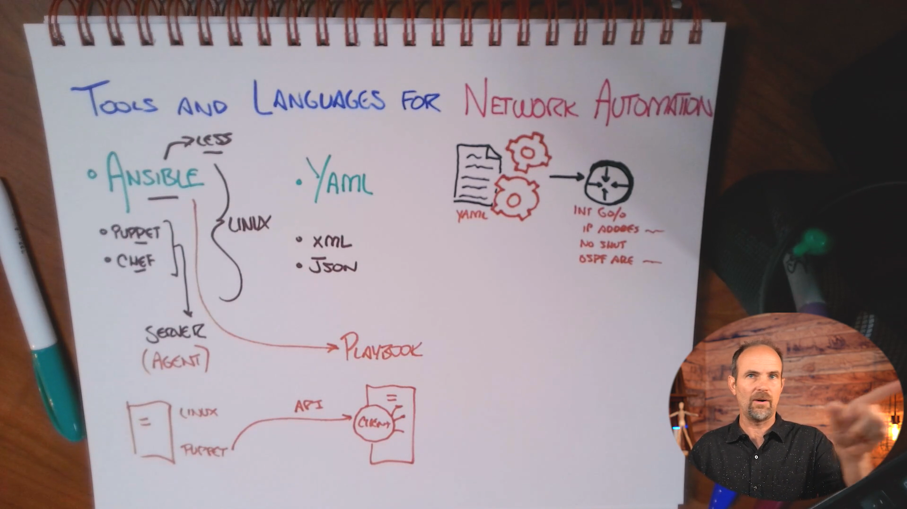

# Skill 26 — Lesson 04: Glancing at Ansible, Puppet, Chef & Markup Languages

## 1. Why Linux Suddenly Matters in Network Automation

Network automation is not limited to Cisco routers and switches. As networks become larger, engineers increasingly use **Linux-based automation systems** to manage infrastructure.

The fundamental problem automation solves is **inconsistency**.

Imagine Castle Rysen Coffee has 100 district shops. Each shop needs:

* Standard VLANs
* Standard IP addressing
* Standard SSH configuration
* Standard security policies
* Standard device names
* Standard routing configuration
* Standard monitoring configuration

Doing this manually means an engineer has to repeat essentially the same configuration 100 times.

Even if the engineer is careful, small differences will eventually appear.

### Manual configuration

```text
Engineer
   |
   +----> Router 1
   +----> Router 2
   +----> Router 3
   +----> Switch 1
   +----> Switch 2
   +----> Switch 3
   ...
```

The problem is that every device becomes an opportunity for human error.

### Automated configuration

```text
                Automation Server
                       |
          +------------+------------+
          |            |            |
       Router        Switch       WAP
          |            |            |
       Same         Same          Same
       policy       policy        policy
```

The automation system applies a **defined configuration repeatedly and consistently**.

---

# 2. Consistency Is the Real Goal

A common misconception is:

> **Automation = making configuration faster.**

Speed is certainly a benefit, but the bigger benefit is **consistency and repeatability**.

Suppose you manually configure 50 switches.

Switch 1:

```text
hostname CR-SW01
vlan 30
 name VIDEO
```

Switch 2:

```text
hostname CR-SW02
vlan 30
 name VIDEO
```

Switch 3:

```text
hostname CR-SW03
vlan 30
 name VIDEO
```

Eventually someone might accidentally configure:

```text
vlan 30
 name CAMERAS
```

The network might still work, but now your supposedly standardized environment isn't standardized anymore.

Automation lets you define the intended configuration **once** and apply it systematically.

---

# 3. Technical Debt

The lesson introduces an extremely important infrastructure concept:

## Technical debt

**Technical debt** occurs when short-term configuration decisions or shortcuts create additional complexity and risk later.

For example:

```text
Day 1:
"Just make this one change manually."

        ↓

Day 30:
"Someone else made another exception."

        ↓

Day 180:
"Nobody remembers why this is configured this way."

        ↓

Day 365:
"Don't touch that device!"
```

The configuration has become difficult to understand and dangerous to modify.

### Automation helps reduce technical debt

Instead of relying on undocumented manual changes:

```text
Human memory
     ↓
Manual CLI
     ↓
One-off configuration
     ↓
Configuration drift
     ↓
Technical debt
```

You can move toward:

```text
Defined configuration
       ↓
Automation
       ↓
Repeatable deployment
       ↓
Consistent infrastructure
       ↓
Easier maintenance
```

---

# 4. Configuration Drift

One of the most important concepts to connect with this lesson is **configuration drift**.

Configuration drift occurs when devices that were supposed to have the same configuration gradually become different.

For example:

| Device | SSH        | VLAN 30 | NTP | ACL |
| ------ | ---------- | ------- | --- | --- |
| SW1    | Configured | Yes     | Yes | Yes |
| SW2    | Configured | Yes     | Yes | Yes |
| SW3    | Configured | No      | Yes | Yes |
| SW4    | Configured | Yes     | No  | Yes |

SW3 and SW4 have **drifted from the intended standard**.

This becomes increasingly dangerous as the organization grows.

Automation helps establish a desired configuration and repeatedly apply it.

---

# 5. Ansible, Puppet and Chef

The lesson introduces three major automation/configuration-management tools:

* **Ansible**
* **Puppet**
* **Chef**

They can manage much more than networking.

They can automate:

* Servers
* Routers
* Switches
* Databases
* Storage
* Applications
* Operating systems
* Network services

The important CCNA-level distinction is particularly around **agent-based vs agentless management**.

---

# 6. What Is an Agent?

An **agent** is software installed on the system being managed.

Conceptually:

```text
                Management Server
                       |
                       |
                  Network
                       |
              +--------+--------+
              |                 |
          Agent on Server A  Agent on Server B
```

The management system communicates with the agent, and the agent performs the required operations.

### Why can this be a problem for networking?

A traditional network switch isn't normally designed for you to install arbitrary configuration-management agents on it.

For example:

```text
Cisco Switch
     |
     +-- IOS
     +-- Interfaces
     +-- VLANs
     +-- Routing
     +-- STP
     |
     X
     |
   Agent?
```

This is why an agent-based architecture isn't always convenient for network infrastructure.

---

# 7. Ansible

## What is Ansible?

**Ansible is an automation and configuration-management platform that is particularly attractive for networking because it is agentless.**

Instead of installing an Ansible agent on every router and switch, Ansible can communicate with devices using supported management mechanisms such as:

* SSH
* APIs
* Other network-management interfaces

The lesson emphasizes **SSH** because you've already encountered SSH when remotely accessing Cisco devices.

Conceptually:

```text
                 Ansible
                    |
          +---------+---------+
          |         |         |
         SSH       SSH       SSH
          |         |         |
       Router     Switch      Router
```

No Ansible agent needs to be installed on each network device.

---

# 8. Why Ansible Is Important for Networking

Suppose Castle Rysen has:

```text
1 Central Office
30 Fallout Shelters
50 District Shops per shelter
```

That's potentially a very large number of network devices.

Imagine manually applying a standard configuration to every device.

Instead:

```text
                    Ansible
                       |
        +--------------+--------------+
        |              |              |
     Shelter 1      Shelter 2      Shelter 3
        |              |              |
      Switches       Switches       Switches
      Routers        Routers        Routers
```

Ansible can execute the defined automation against many devices.

### Result

**Less repetitive CLI work + greater consistency + easier scalability.**

---

# 9. What Is an Ansible Playbook?

A **playbook** is a file containing the instructions Ansible should execute.

Think of it as an **automation recipe**.

Instead of telling an engineer:

> "Log into every switch, create VLAN 30, name it VIDEO, configure the trunk, configure SSH..."

You define those operations in automation.

Conceptually:

```text
Playbook
   |
   +-- Identify devices
   |
   +-- Load variables
   |
   +-- Connect to devices
   |
   +-- Execute tasks
   |
   +-- Verify results
```

The important idea is:

> **A playbook turns a repeatable network procedure into structured automation.**

---

# 10. Example: NetworkChuck Coffee Video VLAN

Suppose every Castle Rysen district shop needs:

```text
VLAN 30
Name: VIDEO
```

because the coffee shops have surveillance cameras and video-related systems.

Without automation:

```text
SW1 → configure manually
SW2 → configure manually
SW3 → configure manually
SW4 → configure manually
...
SW100 → configure manually
```

With Ansible:

```text
                VIDEO VLAN requirement
                         |
                         ↓
                    Playbook
                         |
        +----------------+----------------+
        |                |                |
       SW1              SW2              SW3
        |                |                |
     VLAN 30          VLAN 30          VLAN 30
      VIDEO            VIDEO            VIDEO
```

The same desired configuration can be applied systematically.

---

# 11. Ansible Components

The lesson mentions separating information into different pieces.

A simplified Ansible environment might look like:

```text
Ansible Project
│
├── inventory
│
├── variables
│
└── playbook
```

### Inventory

The inventory identifies the devices Ansible manages.

Conceptually:

```text
District_Shop_Switches
    SW1
    SW2
    SW3

District_Shop_Routers
    R1
    R2
```

### Variables

Variables contain information that can change between devices or environments.

Examples:

```text
hostname
management_ip
vlan_id
vlan_name
```

### Playbook

The playbook defines the operations that should be performed.

Conceptually:

```text
PLAYBOOK
   |
   +-- Connect to switches
   |
   +-- Create VLAN
   |
   +-- Configure trunk
   |
   +-- Configure SSH
   |
   +-- Verify configuration
```

This separation makes automation easier to maintain.

---

# 12. Infrastructure as Code

This lesson leads naturally into a major modern networking concept:

## Infrastructure as Code — IaC

Instead of infrastructure configuration existing only as commands manually entered into devices, configuration is represented in **files**.

For example:

```text
Network requirement
       ↓
Configuration file
       ↓
Automation tool
       ↓
Network devices
```

This provides several advantages:

* Repeatability
* Documentation
* Version control
* Standardization
* Easier rollback
* Easier auditing
* Easier scaling

This is one of the major reasons Git becomes valuable in modern infrastructure environments.

---

# 13. Ansible vs Puppet vs Chef

For the CCNA, don't overcomplicate this.

| Tool        | Important concept                                         |
| ----------- | --------------------------------------------------------- |
| **Ansible** | Agentless automation; very popular for networking         |
| **Puppet**  | Configuration management; commonly associated with agents |
| **Chef**    | Configuration management; commonly associated with agents |
| **Ansible** | Uses playbooks                                            |
| **Ansible** | Commonly uses YAML                                        |

The lesson's main CCNA takeaway is:

> **Know what these tools are and why Ansible is particularly relevant to networking.**

You do **not** need to become an Ansible administrator for this lesson.

---

# 14. Markup Languages and Data Formats

The lesson then moves from automation tools to structured data.

The three formats you need to recognize are:

1. **XML**
2. **JSON**
3. **YAML**

These formats allow information to be represented in a structured, machine-readable form.

Think:

```text
Human-readable text
        ↓
Structured information
        ↓
Automation software
```

---

# 15. XML

## XML — Extensible Markup Language

XML represents data using **tags**.

Example:

```xml
<device>
    <hostname>CR-SW01</hostname>
    <management_ip>10.0.18.2</management_ip>
</device>
```

Notice the opening and closing tags:

```text
<hostname>
        ↓
     value
        ↓
</hostname>
```

### How to recognize XML

Look for:

```text
<tag>
    data
</tag>
```

Lots of `< >` tags are a strong indication you're looking at XML.

### Characteristics

* Tag-based
* Explicit structure
* Human-readable
* Can become verbose
* Frequently encountered in older/enterprise systems and some network technologies

---

# 16. JSON

## JSON — JavaScript Object Notation

JSON represents information using objects, key-value pairs, arrays, braces and brackets.

Example:

```json
{
  "hostname": "CR-SW01",
  "management_ip": "10.0.18.2"
}
```

The basic structure is:

```text
"key": "value"
```

For example:

```json
"hostname": "CR-SW01"
```

means:

```text
key   = hostname
value = CR-SW01
```

---

# 17. JSON Objects

JSON objects use:

```text
{ }
```

Example:

```json
{
  "hostname": "CR-SW01",
  "vlan": 30
}
```

You can have multiple key-value pairs:

```text
{
    key: value,
    key: value,
    key: value
}
```

---

# 18. JSON Arrays

JSON arrays use:

```text
[ ]
```

Example:

```json
{
  "vlans": [
    10,
    20,
    30
  ]
}
```

Or:

```json
{
  "devices": [
    "SW1",
    "SW2",
    "SW3"
  ]
}
```

### Recognition shortcut

If you see:

```text
{ }
```

and lots of:

```text
"key": "value"
```

think:

> **JSON**

---

# 19. Why JSON Matters to Networking

This connects directly to yesterday's **RESTful APIs** lesson.

REST APIs frequently exchange information using JSON.

For example:

```text
Network Automation System
          |
          | HTTP/HTTPS
          ↓
       REST API
          |
          ↓
      JSON data
          |
          ↓
    Network controller
```

So these lessons connect:

```text
Network Automation
       ↓
      APIs
       ↓
     REST
       ↓
     JSON
```

That's why JSON is particularly important for the CCNA automation section.

---

# 20. YAML

## YAML

YAML is a human-friendly format commonly used for configuration and automation.

A simple example:

```yaml
hostname: CR-SW01
management_ip: 10.0.18.2
vlan: 30
```

Notice how clean it is.

There are no XML-style opening and closing tags.

There aren't JSON-style braces and commas everywhere.

---

# 21. YAML Uses Indentation

YAML relies heavily on **indentation** to represent structure.

Example:

```yaml
device:
  hostname: CR-SW01
  management:
    ip: 10.0.18.2
```

The indentation tells you that:

```text
device
 ├── hostname
 └── management
       └── ip
```

This is why YAML can be very readable.

### Important

YAML indentation matters.

Conceptually:

```yaml
device:
  hostname: CR-SW01
```

is structured differently from:

```yaml
device:
hostname: CR-SW01
```

So whitespace is significant.

---

# 22. Why Ansible Uses YAML

Ansible playbooks are commonly written in YAML.

For example, conceptually:

```yaml
- name: Configure network device
  hosts: switches
  tasks:
    - name: Create VIDEO VLAN
      ...
```

You don't need to memorize the syntax for the CCNA.

The important relationship is:

```text
Ansible
   ↓
Playbooks
   ↓
YAML
```

---

# 23. XML vs JSON vs YAML

This is one of the most important memorization tables from this lesson.

| Feature           | XML                | JSON            | YAML                     |
| ----------------- | ------------------ | --------------- | ------------------------ |
| Basic structure   | Tags               | Key-value pairs | Key-value pairs          |
| Visual clue       | `< >`              | `{ }`, `[ ]`    | Indentation              |
| Example           | `<name>SW1</name>` | `"name": "SW1"` | `name: SW1`              |
| Human readability | Good               | Good            | Very good                |
| Common use        | Structured data    | APIs            | Configuration/automation |
| Ansible           | Not primary        | Possible        | **Commonly used**        |

### Quick recognition

```text
<hostname>SW1</hostname>
        ↓
       XML
```

```text
{"hostname": "SW1"}
        ↓
       JSON
```

```text
hostname: SW1
        ↓
       YAML
```

---

# 24. How Everything Connects

This entire lesson is easier to understand as one architecture.

```text
                  NETWORK AUTOMATION
                         |
          +--------------+--------------+
          |                             |
    Automation Tools              Data Formats
          |                             |
   +------+------+                +-----+-----+
   |      |      |                |     |     |
Ansible Puppet Chef             XML   JSON   YAML
   |
Playbooks
   |
   +---- YAML
   |
   +---- Variables
   |
   +---- Inventory
   |
   +---- Tasks
   |
   ↓
Network Devices
```

And REST APIs fit into this larger picture:

```text
                 Automation
                     |
          +----------+----------+
          |                     |
       Ansible                REST API
          |                     |
          |                   JSON
          |                     |
          +----------+----------+
                     |
                     ↓
              Network Devices
```

---

# 25. Castle Rysen Coffee Example

The Castle Rysen RFP specifically requires network automation and programmability.

It calls for:

* Automation techniques
* Puppet, Chef, or Ansible
* Controller-based networking
* Software-defined architectures
* REST-based APIs
* JSON-encoded data 

So imagine Castle Rysen opens **100 district shops**.

Every shop requires:

```text
Admin VLAN
Guest VLAN
Video VLAN
SSH
DHCP
NTP
Security controls
Monitoring
```

Rather than manually configuring each shop:

```text
Shop 1 → CLI
Shop 2 → CLI
Shop 3 → CLI
...
Shop 100 → CLI
```

we can establish a standardized automation workflow:

```text
                  Standard Design
                       |
                       ↓
                 Ansible Playbook
                       |
              +--------+--------+
              |        |        |
           Shop 1    Shop 2   Shop 3 ...
              |        |        |
              ↓        ↓        ↓
          Standard Standard Standard
           config    config    config
```

That is the **scalability advantage of automation**.

---

# 26. The Most Important CCNA Takeaways

### ⭐ 1. Automation isn't only about speed

Its biggest benefits include:

* Consistency
* Repeatability
* Scalability
* Reduced human error
* Easier maintenance

---

### ⭐ 2. Linux appears frequently in automation

Automation platforms commonly run from Linux-based environments.

You don't need deep Linux expertise for this CCNA lesson, but understanding Linux becomes increasingly useful as you progress into network automation.

---

### ⭐ 3. Ansible is agentless

This is probably the **highest-value fact to remember**.

```text
Ansible
   ↓
Agentless
   ↓
Can communicate directly with managed devices
```

This makes it particularly attractive for network automation.

---

### ⭐ 4. Puppet and Chef commonly use agents

The lesson contrasts them with Ansible.

```text
Puppet/Chef
     ↓
Agent-based approach
```

while:

```text
Ansible
     ↓
Agentless approach
```

---

### ⭐ 5. Playbook = Ansible instructions

Think:

> **Playbook = recipe for automation**

It defines what Ansible should do.

---

### ⭐ 6. YAML = Ansible's common language

```text
Ansible
   ↓
Playbook
   ↓
YAML
```

---

### ⭐ 7. JSON = extremely important for APIs

```text
REST API
   ↓
JSON
```

---

### ⭐ 8. Recognize the syntax

**XML**

```xml
<device>
</device>
```

**JSON**

```json
{
  "device": "SW1"
}
```

**YAML**

```yaml
device: SW1
```

---

# 27. Exam-Oriented Recognition

If the question says:

> Which automation tool is agentless?

**Answer: Ansible**

---

> Which automation tool uses playbooks?

**Answer: Ansible**

---

> Which format commonly uses indentation and is heavily used by Ansible?

**Answer: YAML**

---

> Which format commonly uses `{}` and key-value pairs?

**Answer: JSON**

---

> Which format uses opening and closing tags?

**Answer: XML**

---

> Why is Ansible particularly attractive for network automation?

**Answer:** Because it is **agentless**, allowing network devices to be managed without installing an Ansible agent on each device.

---

> What problem does automation primarily help solve in large networks?

**Answer:** **Inconsistency and human error**, while also improving scalability and repeatability.

---

# 🧠 Final Mental Model

Remember this chain:

```text
                NETWORK GROWS
                     ↓
           Manual configuration
                     ↓
          Human inconsistency
                     ↓
             Configuration drift
                     ↓
             Technical debt
                     ↓
             AUTOMATION
                     ↓
       +-------------+-------------+
       |             |             |
    Ansible        Puppet        Chef
       |
   Agentless
       |
   Playbooks
       |
      YAML
       |
       +-------- REST APIs --------+
                     |
                    JSON
                     
XML = tag-based structured data
JSON = API-friendly key/value data
YAML = human-readable automation/configuration data
```

### The one-line summary

> **Modern network automation uses tools such as Ansible to consistently manage infrastructure, with structured formats such as YAML, JSON, and XML providing machine-readable representations of configuration and data.**

This lesson completes the **Ansible/Puppet/Chef + markup-language** portion of Skill 26; your August 28 study plan then moves to **Skill 26 Lesson 05 — What Now?**, the final wrap-up. 
